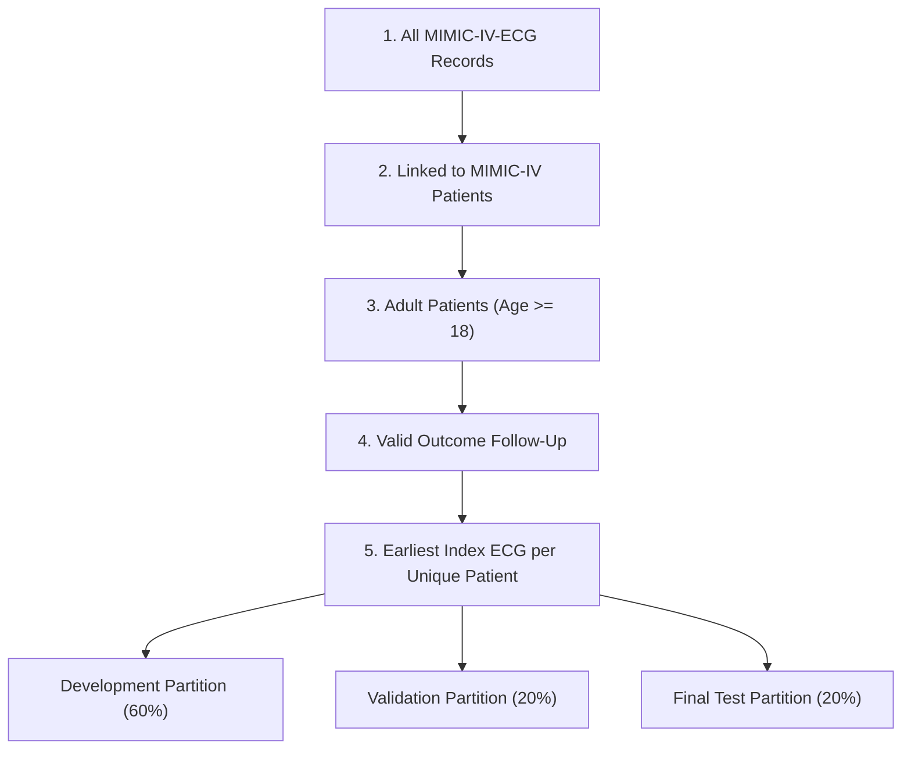

# MIMIC-IV Primary Cohort Flow and Analytic Split Report

**Stage:** Stage 7 — Freeze the Primary Cohort and Split  
**Status:** Completed and Verified  
**Frozen Random Seed:** `42`  
**Partition Target Ratios:** Development 60% / Validation 20% / Final Test 20%  

---

## 1. Primary Cohort Attrition Flow

### Cohort Attrition Table

| Step | Cohort Description | Records ($N$) | Subjects ($N$) | Records Excluded | Subjects Excluded |
| :--- | :--- | :--- | :--- | :--- | :--- |
| **1** | All MIMIC-IV-ECG Records | 800,035 | 161,352 | — | — |
| **2** | Linked to MIMIC-IV Patients | 799,981 | 161,332 | 54 | 20 |
| **3** | Adult Patients (Age >= 18) | 799,928 | 161,306 | 53 | 26 |
| **4** | Valid Outcome Follow-Up | 799,794 | 161,279 | 134 | 27 |
| **5** | Index ECG Selection (Earliest) | 161,279 | 161,279 | 638,515 | — |

---

## 2. Deterministic Patient-Disjoint Partition Summary

| Partition | Intended Ratio | Patient Count ($N$) | Record Count ($N$) | Proportion (%) |
| :--- | :--- | :--- | :--- | :--- |
| **Development (`dev`)** | 60.0% | 96,767 | 96,767 | 60.00% |
| **Validation (`val`)** | 20.0% | 32,256 | 32,256 | 20.00% |
| **Final Test (`test`)** | 20.0% | 32,256 | 32,256 | 20.00% |
| **Total Primary Analytic Cohort** | 100.0% | 161,279 | 161,279 | 100.00% |

---

## 3. Strict Patient-Disjoint Verification

- **Subject Overlap Across Splits:** Exactly **0** subjects appear in more than one partition.
- **Supervised Data Firewall:** The final test set subject IDs (`test`) are permanently frozen.
- **No Test Leakage:** Final test outcome labels and features remain untouched during downstream linear probe fitting or hyperparameter selection.

---

## 4. Stage 7 Exit Criteria Verification

- [x] Adult eligibility ($\text{age} \ge 18$) applied.
- [x] Technical waveform and outcome follow-up eligibility applied.
- [x] Earliest eligible index ECG per patient selected ($N = 161,279$).
- [x] Step-by-step attrition quantified and recorded in cohort flow table.
- [x] Deterministic patient-disjoint split generated with frozen seed (`42`).
- [x] Zero `subject_id` overlap verified across development, validation, and test sets.
- [x] Split assignments can be saved and versioned independently from model outputs.
