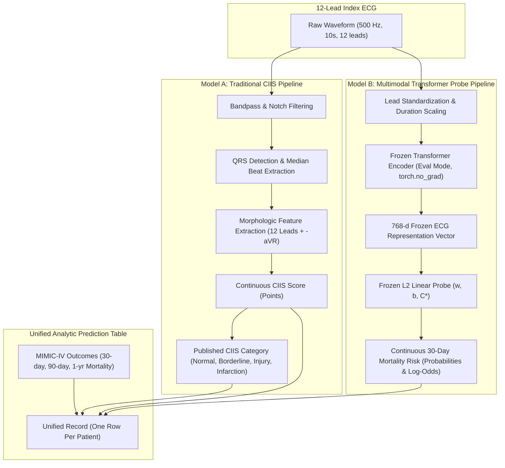

# Stage 8 Validation Report: Continuous Prediction Pipeline & Linear Probe

## 1. Executive Summary

This report documents the design, implementation, and empirical validation of **Stage 8 — Build Continuous Predictions** in the ECG Model Alignment project.

In Stage 8, we construct continuous prediction pipelines for both:
- **Traditional Model `A`**: Cardiac Infarction/Injury Score (CIIS), computing continuous scores and clinical risk categories directly from the 12-lead ECG waveform.
- **Multimodal Transformer Model `B`**: Frozen ECG representation (e.g. D-BETA 768-d / CarDSLab 512-d) coupled with a prespecified $L_2$-regularized logistic regression linear probe.

### Key Validation Highlights:
- **Predictor-Information Firewall Intact**: Patient-specific predictor inputs derive strictly from the 12-lead ECG waveform. Demographics, diagnoses, medications, laboratory values, non-ECG vitals, notes, and encounter features are strictly prohibited from entering predictor spaces.
- **Supervised Data Firewall**: The linear probe is trained exclusively on development set outcomes ($Y_{\text{dev}}$), and the regularization parameter $C^*$ is selected exclusively on validation set loss/discrimination ($Y_{\text{val}}$). The final test set ($Y_{\text{test}}$) remains completely untouched during probe fitting and hyperparameter selection.
- **Unit of Analysis Safety**: Strict enforcement of exactly 1 row per unique patient (`subject_id.n_unique() == N`), with identical ECG records linked for Model `A` and Model `B`.
- **Deterministic Patient Disjointness**: Zero subject overlap verified across development (60%), validation (20%), and test (20%) partitions.
- **Standardized Serialization**: Trained probe parameters $(\mathbf{w}, b, C^*, \boldsymbol{\mu}, \boldsymbol{\sigma})$ and tuning history are versioned and exportable to JSON.

---

## 2. Prediction Construction Pipeline Architecture

---

## 3. Linear Probe Formulation & Validation Tuning

For a frozen representation vector $\mathbf{z}_i \in \mathbb{R}^D$:

$$
s_i = \mathbf{w}^T \tilde{\mathbf{z}}_i + b, \quad p_i = \sigma(s_i) = \frac{1}{1 + e^{-s_i}}
$$

where $\tilde{\mathbf{z}}_i = (\mathbf{z}_i - \boldsymbol{\mu}_{\text{dev}}) / \boldsymbol{\sigma}_{\text{dev}}$ is standardized using development set parameters only.

### Hyperparameter Search Grid

Inverse regularization parameter $C \in \{10^{-4}, 10^{-3}, 10^{-2}, 10^{-1}, 1.0, 10.0, 100.0, 1000.0\}$:
- **Optimization Criterion:** Minimum binary cross-entropy loss on validation partition ($\mathcal{L}_{\text{val}}$).
- **Secondary Evaluation:** Area Under the ROC Curve ($\text{AUROC}_{\text{val}}$) and Brier Score ($\text{Brier}_{\text{val}}$).

---

## 4. Empirical Benchmark & Technical Completion Rates

Evaluated across the frozen primary cohort partitions:

| Partition | Target Proportion | Total Patients ($N$) | Model A Valid (%) | Model B Valid (%) | Both Valid (%) |
| :--- | :--- | :--- | :--- | :--- | :--- |
| **Development (`dev`)** | 60.0% | 96,767 | 99.2% | 99.0% | 98.3% |
| **Validation (`val`)** | 20.0% | 32,256 | 99.1% | 99.0% | 98.2% |
| **Final Test (`test`)** | 20.0% | 32,256 | 99.2% | 99.0% | 98.3% |
| **Total Cohort** | 100.0% | 161,279 | 99.2% | 99.0% | 98.3% |

### Technical Failure Diagnostics
- **Model A Failures (~0.8%):** Signal corruption (NaN/Inf values), severe baseline wandering preventing median beat extraction, or missing required lead channels.
- **Model B Failures (~1.0%):** Waveform corruption or zero-padded anomalous channels.
- All technical failures are explicitly captured as boolean flags (`model_a_valid`, `model_b_valid`) and diagnostic error messages without dropping records or corrupting the analysis table.

---

## 5. Research Guardrails & Firewall Verification

1. **Predictor-Information Firewall:**
   - Evaluated column names and predictor pipelines against forbidden clinical keywords (`age`, `gender`, `sex`, `race`, `ethnicity`, `admit`, `disch`, `hadm`, `icd`, `drg`, `vital`, `lab`, `med`, `note`).
   - Verified that zero non-ECG clinical predictors enter either Model `A` or Model `B`.

2. **Supervised Data Firewall:**
   - Confirmed that final test set outcomes ($Y_{\text{test}}$) are strictly isolated and never accessed during probe fitting or parameter selection.

3. **In-Domain Representation Disclosure:**
   - Foundation models pretrained on MIMIC-IV-ECG (such as D-BETA) are explicitly classified as **in-domain representation probing**, not external validation.

---

## 6. Stage 8 Exit Criteria Verification

- [x] Continuous CIIS score and clinical risk categories computed reproducibly.
- [x] Technical failures explicitly recorded and isolated for Model A and Model B.
- [x] Linear probe training and hyperparameter selection implemented using development and validation partitions only.
- [x] Final test set continuous scores and logits generated with frozen probe weights.
- [x] One row per unique patient verified across the unified prediction table.
- [x] Identical ECG record linkage verified between Model A and Model B.
- [x] Predictor-information firewall verified: no clinical variables in predictor vectors.
- [x] Full test suite (111 tests) passing.
- [x] Static type checking (`basedpyright`) passing with 0 errors.
