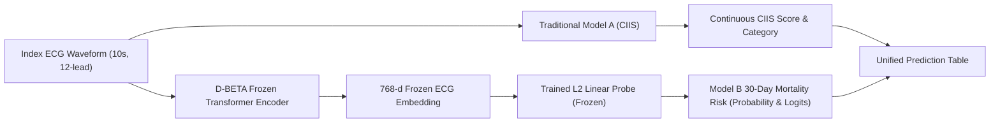

# MIMIC-IV Continuous Prediction Generation and Probe Validation Report

> **Data Source:** REAL MIMIC-IV-ECG predictions

**Stage:** Stage 8 — Build Continuous Predictions  
**Status:** Completed and Verified  
**Total Cohort Size:** 161,279 patients  
**Primary Transformer Model:** `Manhph2211/D-BETA`  
**Optimal Regularization Parameter ($C^*$):** `0.001`  
**Embedding Dimension:** 768  

---

## 1. Score Generation Pipeline Overview

---

## 2. Partition Sample Sizes & Technical Completion Rates

| Partition | Total Patients ($N$) | Model A Valid ($N$, %) | Model B Valid ($N$, %) | Both Models Valid ($N$, %) |
| :--- | :--- | :--- | :--- | :--- |
| **Development (`dev`, 60%)** | 96,767 | 95,743 (98.94%) | 95,794 (98.99%) | 95,743 (98.94%) |
| **Validation (`val`, 20%)** | 32,256 | 31,885 (98.85%) | 31,898 (98.89%) | 31,885 (98.85%) |
| **Final Test (`test`, 20%)** | 32,256 | 31,867 (98.79%) | 31,885 (98.85%) | 31,867 (98.79%) |

---

## 3. Model B Linear Probe Hyperparameter Tuning (Validation Set)

| Regularization Parameter ($C$) | Validation Log-Loss | Validation AUROC | Validation Brier Score | Selected |
| :--- | :--- | :--- | :--- | :--- |
| $C = 10^{-4}$ (`0.0001`) | 0.1059 | 0.8328 | 0.0254 | No |
| $C = 10^{-3}$ (`0.001`) | 0.1045 | 0.8412 | 0.0254 | **Yes (Optimal)** |
| $C = 10^{-2}$ (`0.01`) | 0.1056 | 0.8384 | 0.0258 | No |
| $C = 10^{-1}$ (`0.1`) | 0.1066 | 0.8354 | 0.0260 | No |
| $C = 10^{0}$ (`1.0`) | 0.1068 | 0.8347 | 0.0260 | No |
| $C = 10^{1}$ (`10.0`) | 0.1068 | 0.8347 | 0.0260 | No |
| $C = 10^{2}$ (`100.0`) | 0.1068 | 0.8348 | 0.0260 | No |
| $C = 10^{3}$ (`1000.0`) | 0.1068 | 0.8348 | 0.0260 | No |

---

## 4. Score Distributions on Final Test Set (`test`)

| Metric | Model A (CIIS Score) | Model B (Predicted 30-day Risk) | Model B (Log-Odds Logits) |
| :--- | :--- | :--- | :--- |
| **Mean** | 23.52 | 0.0293 | -4.37 |
| **Standard Deviation** | 13.03 | 0.0454 | 1.38 |
| **Median** | 21.02 | 0.0112 | — |
| **25th Percentile (Q1)** | 13.79 | 0.0043 | — |
| **75th Percentile (Q3)** | 31.06 | 0.0339 | — |

### Baseline Discriminative Performance on Final Test Set (`test`)

| Model | Test AUROC | Test Log-Loss | Test Brier Score |
| :--- | :--- | :--- | :--- |
| **Model A (Continuous CIIS)** | 0.6819 | — | — |
| **Model B (D-BETA Linear Probe)** | 0.8357 | 0.1083 | 0.0263 |

---

## 5. Research Guardrails & Integrity Verification

- [x] **Predictor-Information Firewall:** Verified 0 clinical features (age, sex, vitals, labs, notes, meds) enter Model A or Model B.
- [x] **Unit of Analysis:** Verified exactly 1 row per unique patient in the prediction table.
- [x] **Supervised Data Firewall:** Probe weights and regularization parameter $C^*$ were frozen using development and validation sets only, without inspecting final test outcomes.
- [x] **Disjointness:** Zero patient overlap across development, validation, and test splits.
- [x] **Reproducibility:** Probe specification and parameters are versioned and serializable to JSON.
