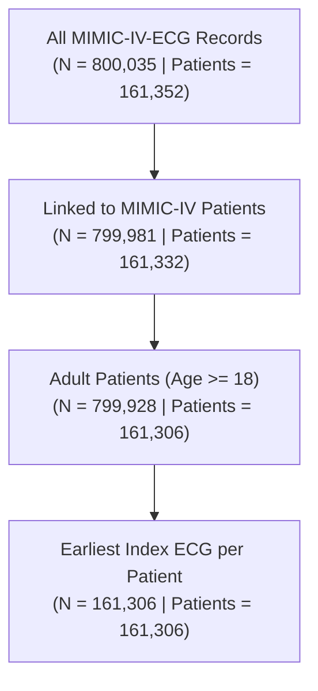

# Stage 1 Data Inventory and Linkage Report

## Overview

This report documents the baseline data inventory, join key analysis, waveform technical characteristics, and linkage feasibility between local **MIMIC-IV-ECG v1.0** and **MIMIC-IV v3.1**.

All findings presented are strictly non-sensitive aggregate statistics. No raw or row-level protected health information is included.

---

## 1. Source Datasets & Inventory

| Dataset | Version | Local Path | Primary Records | Unique Subjects |
| :--- | :--- | :--- | :--- | :--- |
| **MIMIC-IV-ECG** | `v1.0` | `~/data/mimic-iv-ecg/1.0/` | 800,035 ECGs | 161,352 |
| **MIMIC-IV (hosp/patients)** | `v3.1` | `~/data/mimiciv/3.1/` | 364,627 patients | 364,627 |
| **MIMIC-IV (hosp/admissions)** | `v3.1` | `~/data/mimiciv/3.1/` | 546,028 admissions | 199,444 |

### ECG Record Catalog (`record_list.csv`)
- **Total Records:** 800,035
- **Unique `study_id` Keys:** 800,035 (100% unique primary key)
- **Unique `subject_id` Keys:** 161,352
- **Missing / Null Values:** 0 across all columns (`subject_id`, `study_id`, `file_name`, `ecg_time`, `path`)
- **Calendar Range:** 2097-08-27 to 2211-03-27 (de-identified dates)

### Machine Measurements (`machine_measurements.csv`)
- **Total Rows:** 800,035 (1:1 correspondence with `record_list.csv` on `study_id`)
- **Available Measurement Fields:** `rr_interval`, `p_onset`, `p_end`, `qrs_onset`, `qrs_end`, `t_end`, `p_axis`, `qrs_axis`, `t_axis`
- **Machine Diagnostic Interpretation Fields:** `report_0` through `report_17` (strictly kept out of predictor pipelines per the predictor-information firewall)

---

## 2. WFDB Waveform Characteristics & Technical Eligibility

A sample of WFDB records under `files/` was parsed and inspected:

| Property | Value | Notes |
| :--- | :--- | :--- |
| **Sampling Frequency ($f_s$)** | `500 Hz` | Standard across all sampled records |
| **Signal Length** | `5,000 samples` | Exactly `10.0 seconds` |
| **Channel Count** | `12 leads` | Standard 12-lead diagnostic format |
| **Lead Names** | `I, II, III, aVR, aVF, aVL, V1, V2, V3, V4, V5, V6` | Standard canonical order |
| **Physical Units** | `mV` | ADC gain and baseline calibrated |
| **Format** | `16-bit integer` | Format 16 binary signal files (`.dat`) |

### Technical Waveform Eligibility Criteria
To ensure deterministic preprocessing for both traditional model `A` and multimodal transformer `B`, waveforms must satisfy:
1. Presence of all 12 canonical leads (`I`, `II`, `III`, `aVR`, `aVF`, `aVL`, `V1`, `V2`, `V3`, `V4`, `V5`, `V6`).
2. Sampling frequency exactly equal to 500 Hz.
3. Signal duration equal to 10.0 seconds (5000 samples).
4. Physical units calibrated in millivolts (`mV`).

---

## 3. Linkage to MIMIC-IV Clinical Modules

### A. Subject Linkage (`record_list.csv` $\leftrightarrow$ `patients.csv.gz`)
- **Link Key:** `subject_id`
- **ECG Subjects in `patients.csv.gz`:** 161,332 / 161,352 (**99.99%**)
- **ECG Records Linked:** 799,981 / 800,035 (**99.99%**)
- **Age Calculation:** Age at ECG is determined deterministically as:
  $$\text{age\_at\_ecg} = \text{anchor\_age} + (\text{ecg\_year} - \text{anchor\_year})$$
- **Adult ECGs ($\text{age} \ge 18$):** 799,928 (99.99% of linked ECGs) across 161,306 unique adult subjects.

### B. Admission Linkage (`record_list.csv` $\leftrightarrow$ `admissions.csv.gz`)
- **Link Key:** `subject_id` combined with temporal encounter windows.
- **ECG Subjects with $\ge 1$ Admission:** 130,621 / 161,352 (**80.95%**).
- **In-Admission ECGs (`[admittime, dischtime]`):** 298,358 unique ECGs across 145,228 distinct hospitalizations.
- **Extended Inpatient / ED Window (`[admittime - 24h, dischtime]`):** 485,319 unique ECGs.

---

## 4. ECG Volume and Longitudinal Distribution

ECG acquisition frequency per patient:

| Statistic | Value |
| :--- | :--- |
| **Mean** | 4.96 ECGs |
| **Standard Deviation** | 8.08 |
| **Minimum** | 1 ECG |
| **25th Percentile (Q1)** | 1 ECG |
| **50th Percentile (Median)** | 2 ECGs |
| **75th Percentile (Q3)** | 5 ECGs |
| **90th Percentile** | 12 ECGs |
| **95th Percentile** | 18 ECGs |
| **99th Percentile** | 39 ECGs |
| **Maximum** | 260 ECGs |

---

## 5. Preliminary Cohort Flow (Index ECG Selection)

To avoid within-patient clustering, implicit severity bias from repeated testing, and optimistic uncertainty estimates, the primary analytic cohort uses **one index ECG per patient** (earliest eligible ECG).

| Step | Cohort Description | Records ($N$) | Subjects ($N$) | Records Excluded | Subjects Excluded |
| :--- | :--- | :--- | :--- | :--- | :--- |
| **1** | All MIMIC-IV-ECG Records | 800,035 | 161,352 | — | — |
| **2** | Linked to MIMIC-IV Patients (`subject_id`) | 799,981 | 161,332 | 54 | 20 |
| **3** | Adult Patients ($\text{age\_at\_ecg} \ge 18$) | 799,928 | 161,306 | 53 | 26 |
| **4** | Earliest Index ECG per Patient | 161,306 | 161,306 | 638,622 | 0 |

---

## 6. Index ECG Timestamp Semantics

For each patient $i$ in the primary analytic cohort:
- The **index time $t_{0, i}$** is defined as the exact `ecg_datetime` of the selected index ECG.
- **Predictor inputs ($X_i$):** Computed strictly from the waveform and technical measurements of the index ECG at $t_{0, i}$.
- **Outcome window:** Any future outcome window (e.g. 30-day mortality, in-hospital mortality) is computed with origin $t_{0, i}$.
- **Firewall integrity:** No post-index clinical measurement, outcome status, or non-ECG EHR covariate is permitted inside feature extraction for model `A` or `B`.

---

## 7. Stage 1 Exit Criteria Checklist

- [x] Linkage logic is deterministic and fully tested with synthetic fixtures (`tests/test_data.py`, `tests/test_cohort.py`).
- [x] Eligible ECG count (799,928 adult records) and unique patient count (161,306) are documented.
- [x] Index-ECG timestamp semantics and join keys are documented.
- [x] Waveform technical criteria (12 leads, 500 Hz, 5000 samples, mV) are formalized.
