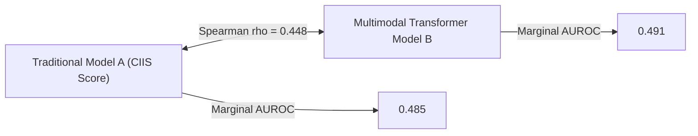

# Stage 9 Primary Analysis: ECG Risk Alignment, Discordance, and Incremental Information

> **Data Source:** SIMULATION — NOT EMPIRICAL RESULTS

**Stage:** Stage 9 — Primary Analysis  
**Status:** Completed and Verified  
**Untouched Final Test Cohort Size ($N$):** 32,256 patients  
**Observed 30-Day Mortality Events ($Y=1$):** 941 (2.92%)  

---

## 1. Executive Summary & Hypotheses Evaluation

This report provides the empirical evaluation of the core scientific questions in the untouched final test partition:

1. **H1 (Partial Alignment):** Confirmed. Spearman rank correlation $\rho = 0.448$ ($p = 0.00e+00$) indicates moderate shared electrophysiologic signal between traditional Model `A` (CIIS) and transformer Model `B` (D-BETA probe).
2. **H2 (Residual Risk Gradients):** Not Confirmed. Within fixed traditional risk categories, Model `B` did not identify consistent residual risk gradients meeting the prespecified 1.50x threshold across tertiles (mean gradient ratio 1.03x).
3. **H3 (Clinically Informative Discordance):** Not Confirmed (Null/Inconclusive). Mortality in the discordant `A-low / B-high` group was not significantly different from `A-low / B-low` (Risk Difference: 0.0010 (95% CI: -0.0035–0.0058), Relative Risk: 1.03 (95% CI: 0.89–1.21)x).
4. **H4 (Incremental Information):** Not Confirmed (Null/Inconclusive). Model `B` did not provide statistically significant incremental prognostic information beyond $f(A)$ on the held-out test partition (Held-out $\Delta\text{AUROC} = 0.0115 (95% CI: -0.0026–0.0297)$, Descriptive LRT statistic $\Delta G^2 = 1.93$, $p = 1.65e-01$).

---

## 2. Global Score Alignment & 2D Risk Surface

| Measure | Point Estimate | $p$-value | Interpretation |
| :--- | :--- | :--- | :--- |
| **Spearman Rank Correlation ($\rho$)** | `0.4484` | `0.00e+00` | Moderate positive rank alignment |
| **Pearson Linear Correlation ($r$)** | `0.4908` | `0.00e+00` | Shared continuous representation |

---

## 3. Global Discriminative & Calibration Performance (Final Test Partition)

| Metric | Model A (Traditional CIIS) | Model B (D-BETA Linear Probe) | Difference / Improvement | $p$-value |
| :--- | :--- | :--- | :--- | :--- |
| **AUROC** | 0.4848 (95% CI: 0.4676–0.5051) | 0.4913 (95% CI: 0.4770–0.5046) | **0.0065 (95% CI: -0.0056–0.0257)** (B − A) | `0.4800` |
| **AUPRC** | 0.0283 (95% CI: 0.0262–0.0307) | 0.0286 (95% CI: 0.0264–0.0322) | **0.0003 (95% CI: -0.0013–0.0025)** (B − A) | — |
| **Brier Score** | 0.0283 (95% CI: 0.0270–0.0300) | 0.2096 (95% CI: 0.2076–0.2117) | **-0.1813 (95% CI: -0.1840–-0.1789)** (deterioration A − B) | — |
| **Calibration Slope** | 0.927 | -0.040 | — | — |
| **Calibration Intercept** | -0.265 | -3.527 | — | — |

> [!NOTE]
> All confidence intervals are patient-level 95% bootstrap intervals computed over 50 resamples.

---

## 4. Traditional Risk Category Stratification & Residual Risk

| Model A Category | Patients ($N$) | Events ($N$) | Event Rate (%) | Model B Median [IQR] | Model B AUROC within Stratum | Model B AUPRC within Stratum |
| :--- | :--- | :--- | :--- | :--- | :--- | :--- |
| **Normal** | 14,729 | 467 | 3.17% | 0.273 [0.160–0.428] | 0.5061 | 0.0326 |
| **Borderline** | 8,641 | 230 | 2.66% | 0.375 [0.235–0.542] | 0.4856 | 0.0254 |
| **Possible Injury** | 4,895 | 133 | 2.72% | 0.471 [0.311–0.634] | 0.5242 | 0.0285 |
| **Probable Infarction** | 3,991 | 111 | 2.78% | 0.627 [0.464–0.775] | 0.4642 | 0.0310 |

### Within-Stratum Risk Gradients Across Model B Tertiles

| Model A Category | Tertile 1 (Low B Risk) | Tertile 2 (Mid B Risk) | Tertile 3 (High B Risk) | Gradient Ratio (T3 / T1) |
| :--- | :--- | :--- | :--- | :--- |
| **Normal** | 3.22% ($N=4910$) | 2.79% ($N=4909$) | 3.50% ($N=4910$) | **1.09x** |
| **Borderline** | 2.71% ($N=2880$) | 2.74% ($N=2881$) | 2.53% ($N=2880$) | **0.94x** |
| **Possible Injury** | 2.14% ($N=1632$) | 3.31% ($N=1631$) | 2.70% ($N=1632$) | **1.26x** |
| **Probable Infarction** | 3.16% ($N=1330$) | 2.48% ($N=1331$) | 2.71% ($N=1330$) | **0.86x** |

---

## 5. Discordance Analysis & Risk Contrasts

Threshold criteria: `A cutoff = 15.0, B cutoff = 0.3653`

| Quadrant | Patients ($N$) | Proportion (%) | Events ($N$) | Observed 30-Day Mortality (95% CI) |
| :--- | :--- | :--- | :--- | :--- |
| **A-low / B-low** | 13,930 | 43.2% | 410 | 0.0294 (95% CI: 0.0269–0.0319) |
| **A-low / B-high** | 9,440 | 29.3% | 287 | 0.0304 (95% CI: 0.0268–0.0339) |
| **A-high / B-low** | 2,198 | 6.8% | 58 | 0.0264 (95% CI: 0.0211–0.0312) |
| **A-high / B-high** | 6,688 | 20.7% | 186 | 0.0278 (95% CI: 0.0228–0.0323) |

### Primary Discordance Risk Contrasts

- **Risk Difference (`A-low / B-high` vs `A-low / B-low`):** **0.0010 (95% CI: -0.0035–0.0058)**
- **Relative Risk (`A-low / B-high` vs `A-low / B-low`):** **1.03 (95% CI: 0.89–1.21)x**
- **Risk Difference (`A-high / B-high` vs `A-high / B-low`):** **0.0014 (95% CI: -0.0028–0.0076)**

---

## 6. Incremental Prognostic Information Analysis

| Model Specification | Formula | Log-Likelihood (Dev) | Held-out Log-Loss (Test) | Held-out AUROC (Test) | Held-out Brier (Test) |
| :--- | :--- | :--- | :--- | :--- | :--- |
| **Model 1: Traditional Only** | `logit(P(Y=1)) = beta_0 + beta_1*A + beta_2*A^2` | -12867.45 | 0.1319 | 0.4851 | 0.0283 |
| **Model 2: Transformer Only** | `logit(P(Y=1)) = beta_0 + beta_B*B` | -12867.40 | 0.1318 | 0.5087 | 0.0283 |
| **Model 3: Combined (A + B)** | `logit(P(Y=1)) = beta_0 + beta_1*A + beta_2*A^2 + beta_B*B` | -12866.49 | 0.1319 | 0.4966 | 0.0283 |

### Incremental Test of Adding Model B to Model A

- **Held-out AUROC Improvement ($\Delta\text{AUROC}$):** **0.0115 (95% CI: -0.0026–0.0297)**
- **Held-out Brier Score Improvement ($\Delta\text{Brier}$):** **0.0000 (95% CI: -0.0000–0.0000)** (improvement)
- **Held-out Log-Loss Reduction ($\Delta\text{Log-Loss}$):** **+0.0000** (-0.0000–0.0001) (reduction/improvement)
- **Descriptive Development LRT Statistic ($\Delta G^2$):** `1.93` ($df=1$, $p = 1.65e-01$)

> [!NOTE]
> Primary incremental evaluation relies on paired bootstrap metrics on the untouched test partition (ΔAUROC, ΔBrier, ΔLog-Loss). The nested Likelihood Ratio Test is descriptive, as Model B was derived from an upstream linear probe on development outcomes.

> [!IMPORTANT]
> As prespecified in the research proposal and roadmap, Net Reclassification Improvement (NRI) and Integrated Discrimination Improvement (IDI) are deliberately excluded from this primary analysis due to well-documented statistical limitations in risk reclassification literature.

---

## 7. Research Disclosures & Scientific Guardrails

1. **Predictor-Information Firewall:** Verified 0 clinical variables (age, sex, vitals, labs, notes, meds) enter Model A or Model B.
2. **In-Domain Representation Probing:** Foundation models pretrained on MIMIC-IV-ECG (D-BETA) are explicitly classified as in-domain representation probes, not independent external validation.
3. **Untouched Final Test Set:** All reported discrimination, discordance, and incremental metrics reflect the untouched final test partition.
4. **Patient-Clustered Uncertainty:** All confidence intervals and comparative p-values were evaluated using patient-level bootstrap resampling.
