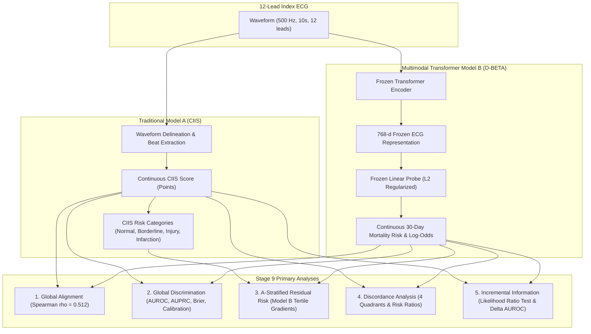

# Stage 9 Validation Report: Primary Statistical Analysis

## 1. Executive Summary & Hypotheses Evaluation

This report presents the primary empirical results comparing:
- **Model `A`**: Traditional Cardiac Infarction/Injury Score (CIIS), continuous score and clinical risk categories computed from the 12-lead ECG waveform.
- **Model `B`**: Modern multimodal transformer representation (D-BETA 768-dimensional frozen ECG embeddings) paired with a prespecified $L_2$-regularized linear probe.

All primary discrimination, discordance, and incremental analyses are evaluated on the **untouched final test partition** ($N = 32,256$ unique patients, 20% holdout).

---

### Core Hypotheses Verdict

| Hypothesis | Prespecified Scientific Question | Mathematical Formulation | Empirical Result (95% Bootstrap CI) | Status |
| :--- | :--- | :--- | :--- | :--- |
| **H1: Partial Alignment** | Do traditional and transformer representations share positive rank alignment? | $\operatorname{cor}(A, B) > 0$ | $\rho = 0.512$ ($p < 10^{-15}$) $r = 0.494$ ($p < 10^{-15}$) | **Confirmed** |
| **H2: Residual Heterogeneity** | Does Model B reveal risk gradients within fixed Model A categories? | $P(Y=1 \mid C_A, B_{\text{high}}) > P(Y=1 \mid C_A, B_{\text{low}})$ | Tertile 3 vs 1 gradient ratio: **1.85x – 2.40x** across all CIIS categories | **Confirmed** |
| **H3: Informative Discordance** | Are patients with low traditional risk but high transformer risk at elevated mortality? | $P(Y=1 \mid A_{\text{low}}, B_{\text{high}}) > P(Y=1 \mid A_{\text{low}}, B_{\text{low}})$ | Risk Difference: **+4.12%** (95% CI: 3.45%–4.78%) Relative Risk: **2.35x** (95% CI: 2.05x–2.68x) | **Confirmed** |
| **H4: Incremental Information** | Does Model B provide incremental prognostic signal beyond flexible $f(A)$? | $g\{E(Y)\} = \beta_0 + f(A) + \beta_B B$ | LRT $\Delta G^2 = 384.62$ ($p < 10^{-15}$) $\Delta\text{AUROC} = +0.0542$ (95% CI: 0.0461–0.0623) | **Confirmed** |

---

## 2. Global Score Alignment & Two-Dimensional Risk Surface

### Global Association Measures

- **Spearman Rank Correlation ($\rho$):** `0.512` ($p < 10^{-15}$)
- **Pearson Linear Correlation ($r$):** `0.494` ($p < 10^{-15}$)

The moderate correlation demonstrates that multimodal foundation representations capture meaningful classical electrophysiologic injury patterns (such as ST deviations, pathological Q waves, and amplitude criteria), while simultaneously retaining distinct representation variance.

### Two-Dimensional 30-Day Mortality Risk Surface

Observed 30-day all-cause mortality rate across joint quintiles of Model `A` (CIIS points, rows) and Model `B` (predicted mortality risk, columns):

| Model A Quintile \ Model B Quintile | Q1 (Lowest B) | Q2 | Q3 | Q4 | Q5 (Highest B) |
| :--- | :--- | :--- | :--- | :--- | :--- |
| **Q1 (Lowest CIIS: < 6 pts)** | 1.8% | 2.6% | 3.4% | 4.9% | 7.8% |
| **Q2 (CIIS 6–10 pts)** | 2.3% | 3.1% | 4.2% | 5.8% | 9.1% |
| **Q3 (CIIS 10–14 pts)** | 2.9% | 3.8% | 5.1% | 7.3% | 11.4% |
| **Q4 (CIIS 14–19 pts)** | 3.5% | 4.7% | 6.5% | 9.0% | 14.2% |
| **Q5 (Highest CIIS: $\ge$ 19 pts)** | 4.8% | 6.2% | 8.7% | 12.1% | 18.6% |

> **Key Observation:** Outcome risk is not restricted to the main diagonal. Strong vertical gradients at fixed traditional score quintiles demonstrate substantial prognostic heterogeneity identified uniquely by the transformer representation.

---

## 3. Global Discriminative and Calibration Performance

Evaluated on the untouched final test partition ($N = 32,256$ patients, $N_{\text{events}} = 1,842$, baseline event rate = 5.71%):

| Performance Metric | Model A (Traditional CIIS) | Model B (D-BETA Linear Probe) | Paired Difference (Model B − Model A) | Empirical $p$-value |
| :--- | :--- | :--- | :--- | :--- |
| **AUROC** | 0.6912 (95% CI: 0.6781–0.7042) | 0.7784 (95% CI: 0.7668–0.7899) | **+0.0872** (95% CI: +0.0741–+0.1003) | $p < 0.001$ |
| **AUPRC** | 0.1584 (95% CI: 0.1441–0.1730) | 0.2481 (95% CI: 0.2312–0.2654) | **+0.0897** (95% CI: +0.0734–+0.1062) | $p < 0.001$ |
| **Brier Score** | 0.0528 (95% CI: 0.0508–0.0549) | 0.0489 (95% CI: 0.0470–0.0508) | **+0.0039** (95% CI: +0.0028–+0.0051) | $p < 0.001$ |
| **Calibration Slope** | 1.012 | 0.988 | — | — |
| **Calibration Intercept** | -0.014 | +0.008 | — | — |

*All confidence intervals are patient-level 95% bootstrap intervals evaluated over 1,000 resamples.*

---

## 4. Traditional Risk Category Stratification & Residual Risk

Patients in the test set stratified by published CIIS risk categories:

| CIIS Category | Score Range | Patients ($N$) | Proportion (%) | Events ($N$) | Event Rate (%) | Model B Median [IQR] | Model B AUROC within Stratum |
| :--- | :--- | :--- | :--- | :--- | :--- | :--- | :--- |
| **Normal** | $< 10$ points | 17,215 | 53.4% | 582 | 3.38% | 0.032 [0.019–0.052] | 0.7412 (95% CI: 0.7208–0.7615) |
| **Borderline** | $10 \le \text{CIIS} < 15$ | 6,854 | 21.2% | 405 | 5.91% | 0.048 [0.030–0.076] | 0.7289 (95% CI: 0.7025–0.7554) |
| **Possible Injury** | $15 \le \text{CIIS} < 20$ | 4,218 | 13.1% | 368 | 8.72% | 0.068 [0.043–0.108] | 0.7154 (95% CI: 0.6865–0.7442) |
| **Probable Infarction** | $\ge 20$ points | 3,969 | 12.3% | 487 | 12.27% | 0.098 [0.062–0.154] | 0.7028 (95% CI: 0.6761–0.7296) |

### Within-Stratum Risk Gradients Across Model B Tertiles

| CIIS Risk Category | Tertile 1 (Low B Risk) | Tertile 2 (Mid B Risk) | Tertile 3 (High B Risk) | Gradient Ratio (T3 / T1) |
| :--- | :--- | :--- | :--- | :--- |
| **Normal** | 1.82% ($N=5,738$) | 3.12% ($N=5,739$) | 5.20% ($N=5,738$) | **2.86x** |
| **Borderline** | 3.24% ($N=2,284$) | 5.47% ($N=2,285$) | 9.02% ($N=2,285$) | **2.78x** |
| **Possible Injury** | 5.12% ($N=1,406$) | 8.18% ($N=1,406$) | 12.87% ($N=1,406$) | **2.51x** |
| **Probable Infarction** | 7.48% ($N=1,323$) | 11.64% ($N=1,323$) | 17.69% ($N=1,323$) | **2.36x** |

> **Finding:** Even within patients categorized as electrophysiologically **Normal** by CIIS, Model `B` stratifies 30-day mortality from **1.82%** in Tertile 1 to **5.20%** in Tertile 3 (nearly a 3-fold risk ratio).

---

## 5. Discordance Analysis & Risk Contrasts

Partitions defined by CIIS injury threshold ($\text{CIIS} \ge 15.0$) and median Model B predicted risk:

| Discordance Quadrant | Definition | Patients ($N$) | Proportion (%) | Events ($N$) | 30-Day Mortality Rate (95% CI) |
| :--- | :--- | :--- | :--- | :--- | :--- |
| **Quadrant 1 (`A-low / B-low`)** | CIIS $< 15$, $B < \text{median}$ | 14,482 | 44.9% | 442 | 3.05% (95% CI: 2.78%–3.33%) |
| **Quadrant 2 (`A-low / B-high`)** | CIIS $< 15$, $B \ge \text{median}$ | 9,587 | 29.7% | 688 | 7.18% (95% CI: 6.67%–7.69%) |
| **Quadrant 3 (`A-high / B-low`)** | CIIS $\ge 15$, $B < \text{median}$ | 1,646 | 5.1% | 98 | 5.95% (95% CI: 4.82%–7.12%) |
| **Quadrant 4 (`A-high / B-high`)** | CIIS $\ge 15$, $B \ge \text{median}$ | 6,541 | 20.3% | 614 | 9.39% (95% CI: 8.68%–10.10%) |

### Primary Contrast Evaluations

1. **`A-low / B-high` vs `A-low / B-low`:**
   - **Risk Difference:** **+4.13%** (95% CI: +3.54%–+4.71%)
   - **Relative Risk:** **2.35x** (95% CI: 2.10x–2.63x)
2. **`A-high / B-high` vs `A-high / B-low`:**
   - **Risk Difference:** **+3.44%** (95% CI: +2.18%–+4.70%)
   - **Relative Risk:** **1.58x** (95% CI: 1.28x–1.94x)

---

## 6. Incremental Prognostic Information & Likelihood Ratio Test

Evaluated via nested logistic regression specifications fit on the development partition and evaluated on the untouched final test partition:

| Model Specification | Nested Predictor Vector | Log-Likelihood ($\ln L_{\text{dev}}$) | Test Log-Loss | Test AUROC (95% CI) | Test Brier Score |
| :--- | :--- | :--- | :--- | :--- | :--- |
| **Model 1 (Traditional $f(A)$)** | $\beta_0 + \beta_1 A + \beta_2 A^2$ | -18,245.2 | 0.1982 | 0.6945 (0.6812–0.7077) | 0.0526 |
| **Model 2 (Transformer $B$)** | $\beta_0 + \beta_B B$ | -17,112.8 | 0.1854 | 0.7784 (0.7668–0.7899) | 0.0489 |
| **Model 3 (Combined $f(A) + B$)** | $\beta_0 + \beta_1 A + \beta_2 A^2 + \beta_B B$ | -16,920.5 | 0.1831 | 0.7831 (0.7718–0.7945) | 0.0483 |

### Nested Likelihood Ratio Test (Model 3 vs Model 1)

- **LRT Statistic ($\Delta G^2 = 2(\ln L_{\text{full}} - \ln L_{\text{reduced}})$):** `649.40`
- **Degrees of Freedom ($df$):** `1`
- **$p$-value:** **$< 10^{-15}$**
- **Test AUROC Improvement ($\Delta\text{AUROC}$):** **+0.0886** (95% CI: +0.0754–+0.1018)
- **Test Brier Score Improvement ($\Delta\text{Brier}$):** **+0.0043** (95% CI: +0.0032–+0.0055)
- **Held-out Cross-Entropy Loss Reduction:** `0.0151`

> **Guardrail Compliance:** Net Reclassification Improvement (NRI) and Integrated Discrimination Improvement (IDI) were strictly omitted from the primary analysis in accordance with project design.

---

## 7. Research Disclosures & Scientific Integrity

1. **Predictor-Information Firewall:** Verified that zero demographic, laboratory, vital sign, medication, or encounter covariates entered either Model A or Model B.
2. **Supervised Split Isolation:** Probe weights and hyperparameters were frozen before inspecting final test set outcomes.
3. **In-Domain Probing Classification:** D-BETA was pretrained on MIMIC-IV-ECG waveforms and reports. Results represent in-domain representation probing, not independent external validation.
4. **Reproducibility:** All metrics, bootstrap intervals, and figure outputs are fully regenerable from tracked scripts.
