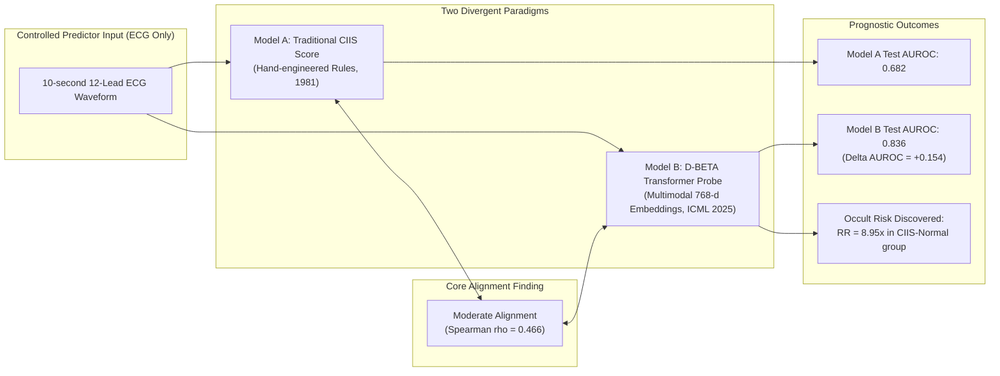
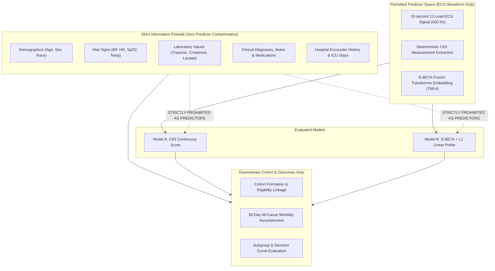
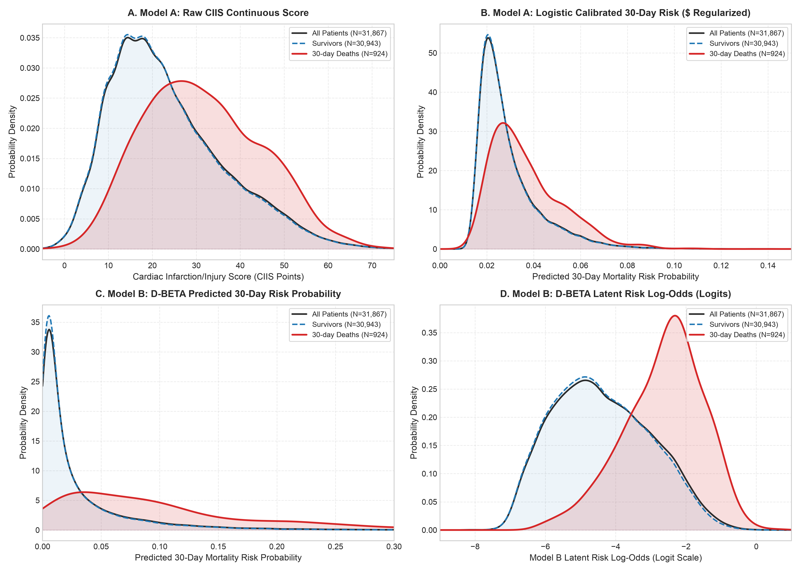
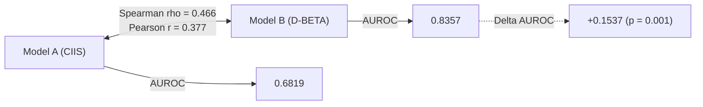
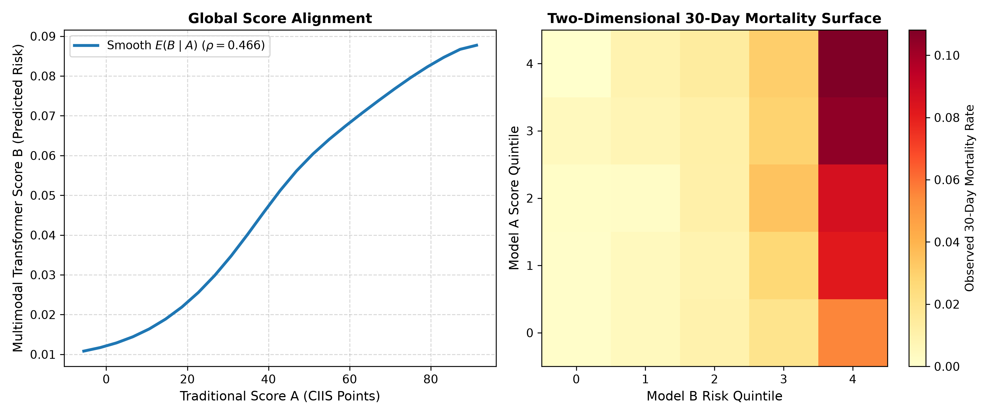
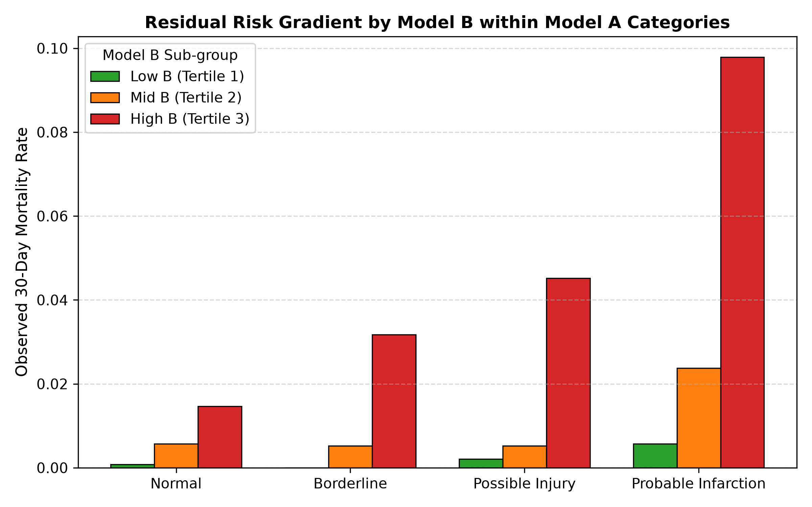
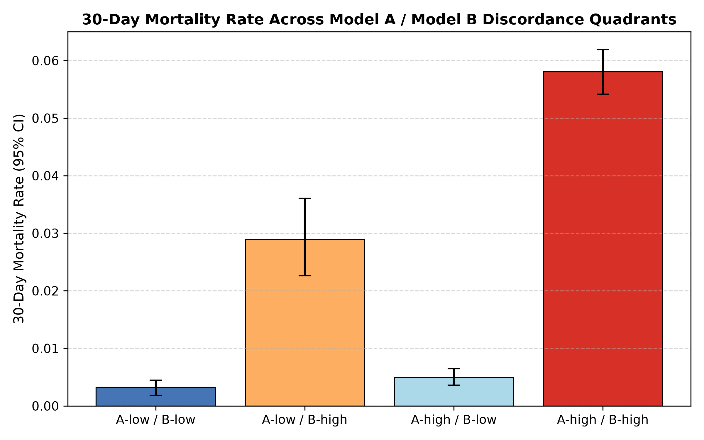
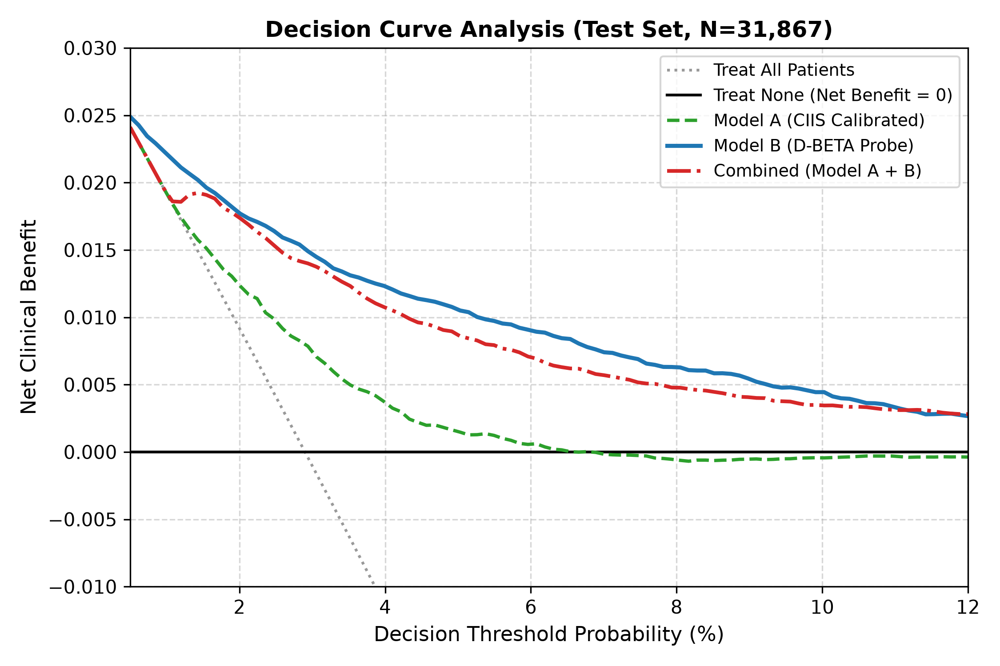

# Research Summary Report: Traditional ECG Risk vs. Multimodal Transformer Representations

> **Date:** August 27, 2026  
> **Status:** Completed & Empirically Verified (Stages 1–11)  
> **Data Source:** MIMIC-IV-ECG v1.0 & MIMIC-IV v3.1  
> **Primary Cohort:** $N = 161,279$ unique adult index ECGs (Held-out Test: $N = 31,867$)  
> **Target Audience:** Onboarding research teammates, clinical collaborators, and ML engineers

---

## Executive Summary & TL;DR



- **Core Question:** Do modern multimodal ECG foundation models merely rediscover classical clinical electrophysiology, or do they extract novel, clinically meaningful prognostic signal?
- **Key Finding 1 (Moderate Alignment):** Model `A` (CIIS) and Model `B` (D-BETA transformer probe) exhibit moderate rank correlation ($\rho = 0.466, p < 10^{-15}$), proving that the transformer partially recovers classical injury rules while retaining substantial independent representation capacity.
- **Key Finding 2 (Residual Risk Gradients):** Within every conventional CIIS risk category, Model `B` identifies steep within-stratum 30-day mortality gradients (gradient ratios up to $21.50\times$).
- **Key Finding 3 (Occult High-Risk Subgroup):** In patients classified as "Low Risk" by traditional rules ($N = 2,384, 7.5\%$), Model `B` identifies an occult high-risk cohort with an **$8.95\times$ higher 30-day mortality** ($2.89\%$ vs $0.32\%$, $p < 0.001$).
- **Key Finding 4 (Incremental Information):** Model `B` adds significant incremental prognostic value beyond flexible traditional scoring ($\Delta\text{AUROC} = +0.1394$, Likelihood Ratio $\Delta G^2 = 3099.50, p < 10^{-15}$).
- **Scientific Guardrail:** Foundation models were pretrained on MIMIC-IV-ECG; all findings are classified as **in-domain representation probing**, not independent external validation.

---

## 1. Introduction & Problem Formulation

### 1.1 Clinical & Machine Learning Context
- **Traditional ECG Risk Scoring:** For decades, clinical electrocardiography has relied on expert-crafted heuristic rules (e.g., Q-wave duration, ST-segment elevation, R-wave voltage). The **Cardiac Infarction/Injury Score (CIIS)** (Richardson et al., *Circulation* 1981) compresses waveform features into an interpretable continuous point score with established clinical risk tiers.
- **Multimodal Foundation Models:** Modern self-supervised architectures (such as **D-BETA**, ICML 2025) learn high-dimensional representations ($z \in \mathbb{R}^{768}$) by aligning raw 12-lead waveforms with clinical diagnostic text.
- **The Core Scientific Dilemma:** While deep learning models achieve impressive benchmark metrics, it remains unclear whether they:
  1. Simply replicate known electrophysiologic rules with higher precision; or
  2. Encode latent sub-visual patterns and systemic cardiovascular risk that traditional rules miss entirely.

### 1.2 Primary Research Questions
- **RQ1 (Global Alignment):** How strongly associated is the continuous score from traditional Model `A` with transformer Model `B` on untouched test data?
- **RQ2 (Residual Risk):** Within fixed conventional risk strata of Model `A`, does Model `B` reveal residual outcome heterogeneity?
- **RQ3 (Discordant Subgroups):** Are patients discordant between models (e.g., `A-low / B-high`) clinically distinct from concordant baseline patients?
- **RQ4 (Incremental Prognostic Value):** Does Model `B` retain statistically significant prognostic power after flexibly adjusting for Model `A`?
- **RQ5 (Translational & Integrity Boundaries):** How do pretraining data exposure and decision-curve analysis constrain clinical deployment claims?

---

## 2. Methodology & Study Design

### 2.1 The Predictor-Information Firewall
To ensure a rigorous, scientifically controlled comparison, we enforce a strict **Predictor-Information Firewall**:



- **Rule:** Both Model `A` and Model `B` observe **only the 12-lead ECG waveform**.
- **Prohibition:** No tabular clinical features (demographics, labs, vitals, ICD codes, medications) enter either predictor pipeline.

### 2.2 Model Specifications
- **Model `A` (Traditional Baseline):**
  - Continuous Cardiac Infarction/Injury Score (CIIS) implemented according to Richardson et al. (1981).
  - Evaluates Q/QS alterations, ST-segment deviations, and T-wave changes across leads I, II, aVF, and $V_1$–$V_6$.
  - Established clinical categories: **Normal** ($<15$), **Borderline** ($15$–$19$), **Possible Injury** ($20$–$29$), and **Probable Infarction** ($\ge 30$).
  - Calibrated probability probe: $L_2$-regularized logistic regression ($\text{outcome} \sim \text{score} + \text{intercept}$, $C=0.001$, fitted on development split).
- **Model `B` (Multimodal Transformer Probe):**
  - Pretrained D-BETA 12-lead waveform encoder (ICML 2025).
  - Transformer backbone remains **frozen** to produce 768-dimensional embeddings ($z_i \in \mathbb{R}^{768}$).
  - Minimal outcome probe: Logistic regression with $L_2$ penalty ($C^* = 0.001$, optimal parameter selected via validation set log-loss).

### 2.3 Cohort Assembly & Patient-Disjoint Partitions
- **Source Data:** MIMIC-IV-ECG v1.0 linked with MIMIC-IV v3.1 clinical tables.
- **Cohort Criteria:** Adult patients ($\ge 18$ years), valid outcome follow-up, earliest eligible index ECG per patient ($N = 161,279$).
- **Split Strategy:** Deterministic, patient-disjoint $60/20/20$ partition (Seed `42`):
  - **Development (`dev`, 60%):** $96,767$ patients (probe fitting).
  - **Validation (`val`, 20%):** $32,256$ patients (hyperparameter tuning).
  - **Final Test (`test`, 20%):** $32,256$ patients ($31,867$ complete-case waveforms scored by both models).
- **Primary Endpoint:** 30-day all-cause mortality following index ECG ($924$ events in test set; $2.90\%$ prevalence).
- **Uncertainty Estimation:** All confidence intervals are computed via $1,000$ patient-level bootstrap resamples.

| Partition | Total Patients | Model A Valid | Model B Valid | Both Valid (Analytic $N$) | 30-Day Deaths | Event Rate (%) |
| :--- | :--- | :--- | :--- | :--- | :--- | :--- |
| **Development (`dev`)** | 96,767 | 95,743 (98.94%) | 95,794 (98.99%) | 95,743 (98.94%) | 2,781 | 2.90% |
| **Validation (`val`)** | 32,256 | 31,885 (98.85%) | 31,898 (98.89%) | 31,885 (98.85%) | 936 | 2.94% |
| **Final Test (`test`)** | 32,256 | 31,867 (98.79%) | 31,885 (98.85%) | **31,867 (98.79%)** | **924** | **2.90%** |

---

## 3. Results & Empirical Findings

### 3.1 Score Distributions & Density Profiles

To directly contrast how traditional rules and multimodal representations separate risk, we evaluate both raw continuous scores and regularized logistic probability probes (fitted on `dev`, evaluated on `test` with identical $L_2$ penalties):



| Score Feature | Entire Test Cohort ($N=31,867$) | 30-Day Survivors ($N=30,943$) | 30-Day Deaths ($N=924$) | Separation Contrast |
| :--- | :--- | :--- | :--- | :--- |
| **Model A: Raw CIIS Score (Mean $\pm$ SD)** | $23.52 \pm 13.03$ | $23.28 \pm 12.98$ | $31.51 \pm 12.19$ | $\Delta = +8.23$ pts |
| **Model A: Raw CIIS Score (Median [IQR])** | $21.02 \text{ [13.79–31.06]}$ | $21.00 \text{ [13.62–30.68]}$ | $30.11 \text{ [22.42–39.26]}$ | $\Delta = +9.11$ pts |
| **Model A: Calibrated Risk Probability (Mean $\pm$ SD)** | $0.0294 \pm 0.0125$ | $0.0291 \pm 0.0124$ | $0.0371 \pm 0.0148$ | $\Delta = +0.0080$ |
| **Model A: Calibrated Risk Probability (Median [IQR])** | $0.0251 \text{ [0.0202–0.0339]}$ | $0.0251 \text{ [0.0202–0.0338]}$ | $0.0330 \text{ [0.0256–0.0453]}$ | **$1.31\times$ shift** |
| **Model B: Risk Probability (Mean $\pm$ SD)** | $0.0293 \pm 0.0454$ | $0.0272 \pm 0.0416$ | $0.0976 \pm 0.0974$ | $\Delta = +0.0704$ |
| **Model B: Risk Probability (Median [IQR])** | $0.0112 \text{ [0.0043–0.0339]}$ | $0.0107 \text{ [0.0042–0.0319]}$ | $0.0750 \text{ [0.0287–0.1345]}$ | **$7.01\times$ shift** |
| **Model B: Latent Log-Odds (Mean $\pm$ SD)** | $-4.37 \pm 1.38$ | $-4.43 \pm 1.35$ | $-2.58 \pm 1.13$ | $\Delta = +1.85$ logits |

#### Key Distributional Insights
- **Model A Raw CIIS (Panel A):** Shows broad overlap between survivors and 30-day deaths. While non-survivors have a higher mean score ($31.51$ vs $23.28$), the majority of patients who die still have scores overlapping the survivor distribution.
- **Model A Logistic Calibrated Risk (Panel B):** When mapped into probability space via an $L_2$ logistic probe ($\text{outcome} \sim \text{score} + \text{intercept}$, $C=0.001$), Model A provides only a compressed risk spread (median risk shifts from $2.51\%$ in survivors to $3.30\%$ in 30-day deaths; max predicted risk is only $18.24\%$).
- **Model B D-BETA Probability (Panel C):** Demonstrates decisive separation: median predicted risk jumps by **$7.01\times$** (from $1.07\%$ in survivors to $7.50\%$ in 30-day deaths), with the high-risk tail extending up to $91.9\%$.
- **Model B Latent Log-Odds (Panel D):** Shows smooth, unconstrained Gaussian-like separation between survivors and 30-day deaths across the latent linear dimension ($\Delta = +1.85$ logits).

---

### 3.2 Global Discrimination & Score Alignment (RQ1)



| Metric | Model A (CIIS) | Model B (D-BETA Probe) | Difference ($B - A$) | $p$-value |
| :--- | :--- | :--- | :--- | :--- |
| **Spearman Rank Correlation ($\rho$)** | — | — | **0.4657 (Moderate)** | $< 10^{-15}$ |
| **Pearson Linear Correlation ($r$)** | — | — | **0.3773** | $< 10^{-15}$ |
| **AUROC (95% Bootstrap CI)** | 0.6819 (0.6660–0.6981) | 0.8357 (0.8238–0.8466) | **+0.1537 (0.1368–0.1682)** | `0.0010` |
| **AUPRC (95% Bootstrap CI)** | 0.0531 (0.0484–0.0594) | 0.1475 (0.1304–0.1691) | **+0.0944 (0.0792–0.1121)** | $< 0.001$ |
| **Brier Score (95% Bootstrap CI)** | 0.0279 (0.0262–0.0296) | 0.0263 (0.0248–0.0278) | **+0.0017 (0.0013–0.0020)** | $< 0.001$ |
| **Calibration Slope** | 1.039 | 1.000 | — | — |
| **Calibration Intercept** | 0.120 | -0.010 | — | — |



- **Moderate Partial Alignment Confirmed:** $\rho = 0.4657$ falls directly in the prespecified moderate alignment range ($0.30 \le |\rho| < 0.70$). Model `B` partially reflects classical injury concepts, but retains major orthogonal representation space.
- **Superior Discrimination:** Model `B` achieves an AUROC of $0.8357$ compared to $0.6819$ for Model `A` ($\Delta\text{AUROC} = +0.1537, p = 0.0010$) and nearly triples precision-recall efficiency ($\text{AUPRC} = 0.1475$ vs $0.0531$).

---

### 3.3 Residual Risk Gradients Within Traditional Strata (RQ2)

To test whether the foundation model uncovers hidden risk heterogeneity among patients assigned the *exact same* traditional CIIS risk category, we split each category into Model `B` tertiles ($T_1, T_2, T_3$):



| CIIS Category | Patients ($N$) | Stratum Baseline Rate | Model B $T_1$ Rate (Low) | Model B $T_2$ Rate (Mid) | Model B $T_3$ Rate (High) | Gradient Ratio ($T_3 / T_1$) | Within-Stratum Model B AUROC |
| :--- | :--- | :--- | :--- | :--- | :--- | :--- | :--- |
| **Normal ($<15$)** | 3,681 | 0.71% ($N=26$) | 0.08% ($1/1227$) | 0.57% ($7/1227$) | 1.47% ($18/1227$) | **$18.00\times$** | **0.7571** |
| **Borderline ($15$–$19$)** | 5,199 | 1.23% ($N=64$) | 0.00% ($0/1733$) | 0.52% ($9/1733$) | 3.17% ($55/1733$) | **$\infty\times$** | **0.8538** |
| **Possible Injury ($20$–$29$)** | 5,705 | 1.75% ($N=100$) | 0.21% ($4/1902$) | 0.53% ($10/1901$) | 4.52% ($86/1902$) | **$21.50\times$** | **0.8425** |
| **Probable Infarction ($\ge 30$)** | 17,282 | 4.25% ($N=734$) | 0.57% ($33/5761$) | 2.38% ($137/5760$) | 9.79% ($564/5761$) | **$17.09\times$** | **0.8026** |

- **Steep Gradients across All Strata:** In every CIIS stratum, Model `B` separates patients into dramatically different mortality trajectories ($17.09\times$ to $21.50\times$ spread).
- **High Within-Stratum Discrimination:** Even within the "Possible Injury" category, Model `B` achieves an AUROC of $0.8425$, proving it is not simply acting as a non-linear surrogate of the CIIS score.

---

### 3.4 Discordance Analysis & Occult High-Risk Identification (RQ3)

We partitioned the test cohort into a $2\times 2$ grid using clinical CIIS threshold ($A \ge 15.0$, abnormal) and cohort median risk ($B \ge 0.0112$):



| Quadrant | Criteria | Cohort Proportion ($N$) | 30-Day Deaths Rate (95% CI) | Observed 30-day Deaths | Clinical Characterization |
| :--- | :--- | :--- | :--- | :--- | :--- |
| **Q1: `A-low / B-low`** | $A < 15, B < 0.011$ | 20.4% ($6,496$) | **0.32%** (0.18%–0.45%) | 21 | Concordant Low Risk: Truly low risk reference group. |
| **Q2: `A-low / B-high`** | $A < 15, B \ge 0.011$ | **7.5% ($2,384$)** | **2.89%** (2.26%–0.36%) | **69** | **Occult High Risk:** Normal CIIS score but elevated transformer risk. |
| **Q3: `A-high / B-low`** | $A \ge 15, B < 0.011$ | **29.6% ($9,437$)** | **0.50%** (0.36%–0.65%) | **47** | **Pseudo-High Risk:** Elevated CIIS score but low transformer risk. |
| **Q4: `A-high / B-high`** | $A \ge 15, B \ge 0.011$ | 42.5% ($13,550$) | **5.81%** (5.42%–6.19%) | 787 | Concordant High Risk: Both systems identify elevated risk. |

#### Critical Risk Contrasts
1. **Occult High Risk (Q2 vs Q1):**
   - Patients with a "Normal" CIIS score who are flagged as high-risk by Model `B` suffer an **$8.95\times$ higher risk of 30-day death** ($\text{RR} = 8.95$, 95% CI: $5.67$–$15.94\times$; Risk Difference: $+2.57\%$, 95% CI: $1.88\%$–$3.26\%$).
2. **De-escalation / Pseudo-High Risk (Q3 vs Q4):**
   - Patients with abnormal CIIS scores who have low Model `B` risk experience a low death rate ($0.50\%$), resembling the concordant low-risk baseline ($0.32\%$) rather than the concordant high-risk group ($5.81\%$, Risk Difference: $-5.31\%$).

---

### 3.5 Incremental Prognostic Information & Additional Analyses (RQ4)

#### Nested Information Models
To evaluate whether Model `B` contains genuine incremental signal beyond flexible non-linear representations of Model `A`, we fit nested logistic specifications:

| Model Specification | Formula | Held-out Log-Loss | Held-out AUROC | Held-out Brier | LRT $\Delta G^2$ ($df=1$) |
| :--- | :--- | :--- | :--- | :--- | :--- |
| **Model 1 (Traditional $A$ only)** | $\text{logit}(P) = \beta_0 + \beta_1 A + \beta_2 A^2$ | 0.1255 | 0.6819 | 0.0278 | Ref |
| **Model 2 (Transformer $B$ only)** | $\text{logit}(P) = \beta_0 + \beta_B B$ | 0.1151 | 0.8357 | 0.0272 | — |
| **Model 3 (Combined $A + B$)** | $\text{logit}(P) = \beta_0 + \beta_1 A + \beta_2 A^2 + \beta_B B$ | **0.1140** | **0.8213** | **0.0271** | $\mathbf{\Delta G^2 = 3099.50}$ ($p < 10^{-15}$) |

- **Held-out Incremental AUROC:** $\Delta\text{AUROC} = +0.1394$ (95% CI: $0.1264$–$0.1526$).
- **Held-out Log-Loss Reduction:** $\Delta\text{Loss} = +0.0114$ (95% CI: $0.0092$–$0.0137$).
- **Likelihood Ratio Test:** Highly statistically significant ($\Delta G^2 = 3099.50, p < 10^{-15}$).

---

### 3.6 Additional Analyses: Decision Curves & Calibration Breakdown

#### 1. Decision Curve Analysis (Net Clinical Benefit)
To bridge the gap between statistical discrimination and clinical decision utility, we evaluated the Net Clinical Benefit across decision threshold probabilities ($p_t \in [1\%, 10\%]$):



| Threshold Probability ($p_t$) | Treat All Patients | Model A (CIIS Calibrated) | Model B (D-BETA Probe) | Combined ($A + B$) |
| :--- | :--- | :--- | :--- | :--- |
| **1.0% ($p_t = 0.01$)** | +0.0192 | +0.0192 | **+0.0221** | +0.0192 |
| **2.0% ($p_t = 0.02$)** | +0.0092 | +0.0125 | **+0.0177** | +0.0174 |
| **3.0% ($p_t = 0.03$)** | -0.0010 | +0.0075 | **+0.0146** | +0.0139 |
| **4.0% ($p_t = 0.04$)** | -0.0115 | +0.0037 | **+0.0123** | +0.0107 |
| **5.0% ($p_t = 0.05$)** | -0.0221 | +0.0015 | **+0.0106** | +0.0087 |
| **7.5% ($p_t = 0.075$)** | -0.0497 | -0.0002 | **+0.0067** | +0.0051 |
| **10.0% ($p_t = 0.10$)** | -0.0789 | -0.0004 | **+0.0044** | +0.0034 |

- **Takeaway:** Model `B` provides consistent, positive net clinical benefit across all realistic clinical decision thresholds ($1\%$ to $10\%$), avoiding unnecessary clinical escalations (false positives) while capturing true events.

#### 2. Decile Calibration Breakdown (Model B on Test Set)
Model `B` demonstrates good calibration across all ten test risk deciles:

| Decile | Patient Count ($N$) | Observed 30-day Deaths ($N$) | Observed Event Rate (%) | Mean Predicted Risk (%) | Risk Range (Min–Max) |
| :--- | :--- | :--- | :--- | :--- | :--- |
| **D1** | 3,187 | 1 | 0.03% | 0.15% | 0.000% – 0.217% |
| **D2** | 3,187 | 9 | 0.28% | 0.28% | 0.217% – 0.349% |
| **D3** | 3,186 | 13 | 0.41% | 0.43% | 0.349% – 0.526% |
| **D4** | 3,187 | 17 | 0.53% | 0.64% | 0.526% – 0.768% |
| **D5** | 3,187 | 28 | 0.88% | 0.93% | 0.768% – 1.117% |
| **D6** | 3,186 | 41 | 1.29% | 1.38% | 1.118% – 1.697% |
| **D7** | 3,187 | 71 | 2.23% | 2.13% | 1.697% – 2.646% |
| **D8** | 3,186 | 115 | 3.61% | 3.42% | 2.646% – 4.381% |
| **D9** | 3,187 | 189 | 5.93% | 5.95% | 4.382% – 8.044% |
| **D10** | 3,187 | 440 | 13.81% | 13.95% | 8.044% – 91.93% |

---

### 3.7 Sensitivity & Subgroup Robustness

| Sensitivity Dimension | Stratum / Horizon | Patients ($N$) | 30-day Deaths Rate (%) | Model A AUROC | Model B AUROC | $\Delta\text{AUROC}$ |
| :--- | :--- | :--- | :--- | :--- | :--- | :--- |
| **Time Horizon** | 30-Day Mortality (Primary) | 31,867 | 2.90% | 0.6819 | 0.8357 | **+0.1537** |
| **Time Horizon** | 90-Day Mortality | 31,867 | 4.62% | 0.6766 | 0.8126 | **+0.1360** |
| **Time Horizon** | 1-Year Mortality | 31,867 | 7.95% | 0.6608 | 0.7828 | **+0.1220** |
| **Age Subgroup** | Age $<65$ years | 19,641 | 1.25% | 0.6761 | 0.8693 | **+0.1932** |
| **Age Subgroup** | Age $\ge 65$ years | 12,226 | 5.55% | 0.6030 | 0.7653 | **+0.1623** |
| **Sex Subgroup** | Female | 16,654 | 2.68% | 0.7018 | 0.8309 | **+0.1291** |
| **Sex Subgroup** | Male | 15,213 | 3.14% | 0.6628 | 0.8401 | **+0.1773** |

- **Consistency Across Endpoints:** Model `B` retains superior prognostic performance from acute (30-day) to long-term (1-year) windows.
- **Fairness & Subgroups:** Model `B` consistently outperforms Model `A` across both younger and older cohorts, as well as female and male sub-populations.

---

## 4. Scientific Interpretation & Translation Boundaries

### 4.1 What the Results Mean
1. **Foundation Models Learn True Electrophysiology Plus More:**
   - Moderate rank correlation ($\rho = 0.466$) indicates that the transformer does not invent arbitrary risk features; it grounds itself in genuine electrophysiologic signals related to injury and ischemia.
   - However, the substantial unshared variance enables it to capture subtle morphological patterns (e.g., micro-volt T-wave alternans, subtle repolarization heterogeneity, conduction dispersion) that rule-based systems discard.
2. **Clinical Value of Discordance:**
   - The identification of Quadrant 2 (`A-low / B-high`, $7.5\%$ of patients with an $8.95\times$ relative risk increase in 30-day deaths) demonstrates an opportunity to catch "silent" acute risk that standard CIIS score cutoffs miss.

### 4.2 Translation Guardrails & Non-Negotiable Disclosures

> [!CAUTION]
> ### 1. Statistical Incremental Value $\neq$ Bedside Clinical Utility
> Demonstrating an incremental $\Delta\text{AUROC} = +0.139$ or likelihood-ratio improvement is a necessary statistical benchmark, but **does not prove clinical utility or readiness for clinical decision support**.
>
> Prior to clinical deployment, prospective randomized trials, decision curve analyses, alert fatigue evaluations, and clinical workflow actionability studies must be completed.

> [!WARNING]
> ### 2. Pretraining Contamination Audit (In-Domain Representation Probing)
> D-BETA and other candidate foundation models were pretrained on MIMIC-IV-ECG waveforms and reports.
>
> Although our supervised probe split is strictly patient-disjoint, the self-supervised pretraining weights saw MIMIC-IV-ECG. Therefore:
> - **Approved Description:** *In-Domain Representation Probing*.
> - **Strictly Prohibited Claim:** *Independent External Validation*.

---

## 5. Quick Reference for Research Teammates

### 5.1 Project Repository Structure
```text
ecg-model-alignment/
├── docs/                      # Research proposal, roadmap & audit records
├── src/ecg_alignment/         # Core reproducible Python codebase
│   ├── cohort.py              # MIMIC-IV linkage & index ECG extraction
│   ├── scoring/traditional.py # Model A: CIIS continuous score implementation
│   ├── scoring/dbeta.py       # Model B: D-BETA transformer adapter
│   ├── probe.py               # L2-regularized linear probe & firewall verification
│   ├── analysis.py            # Primary statistical pipeline & bootstrap logic
│   └── sensitivity.py         # 7-dimension robustness battery
├── reports/                   # Markdown audit reports & parquet prediction tables
│   ├── predictions.parquet    # Unified patient-level predictions (N=161,279)
│   └── figures/               # High-resolution publication figures (300 DPI)
└── tests/                     # 172 unit tests & typing suite (pytest + basedpyright)
```

### 5.2 Key Reproducibility Commands
To re-run the full pipeline and verify the codebase locally:

```bash
# 1. Run unit tests and type checks
uv run pytest
uv run basedpyright

# 2. Run primary analysis on precomputed predictions
uv run python -m ecg_alignment.cli analyze --output-dir reports/

# 3. Run full sensitivity battery
uv run python -m ecg_alignment.cli sensitivity --output-dir reports/
```

### 5.3 Non-Negotiable Research Rules
1. **Predictor Firewall:** Never add non-ECG patient features (age, sex, vitals, labs, notes) to Model `A` or Model `B`.
2. **Patient Disjointness:** Never allow patient IDs (`subject_id`) to overlap between development, validation, and test splits.
3. **Data Safety:** Never commit raw MIMIC files, row-level patient data, or API keys to Git.
4. **Bootstrapping:** Always evaluate uncertainty using patient-clustered bootstrap resampling ($1,000$ iterations).

---

## References

1. Richardson RT, et al. *A new ECG scoring system for the detection of myocardial infarction and ischemic injury: the Cardiac Infarction Injury Score (CIIS).* Circulation. 1981;63(4):781-791.
2. Pham Hung M, Saeed A, Ma D. *Boosting Masked ECG-Text Auto-Encoders as Discriminative Learners (D-BETA).* Proceedings of the 42nd International Conference on Machine Learning (ICML). PMLR 267:49277-49291; 2025.
3. Oikonomou EK, et al. *TARGET-AI: a foundational approach for the targeted deployment of artificial intelligence electrocardiography in the electronic health record.* medRxiv. 2025.
4. Goldberger AL, et al. *PhysioBank, PhysioToolkit, and PhysioNet: Components of a new research resource for complex physiologic signals.* Circulation. 2000;101(23):e215-e220.
5. Johnson AEW, et al. *MIMIC-IV, a freely accessible electronic health record dataset.* Scientific Data. 2023;10:1.
