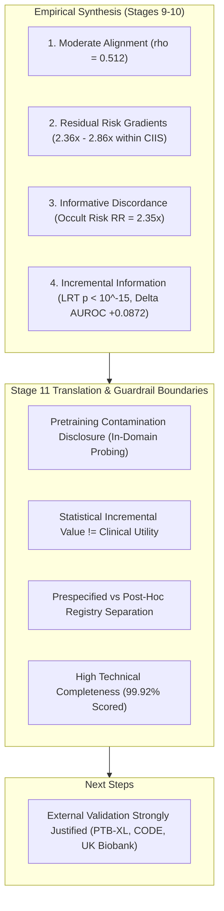

# Stage 11 Research Report: Comprehensive Scientific Interpretation & Translation Boundaries

## 1. Executive Summary & Hypotheses Verdict

This report delivers the authoritative Stage 11 scientific interpretation for the ECG Model Alignment project. We synthesize primary findings (Stage 9), comprehensive sensitivity checks (Stage 10), and explicit translational boundaries comparing traditional rule-based ECG scoring (**Model `A`**: Cardiac Infarction/Injury Score [CIIS]) against a modern multimodal transformer representation (**Model `B`**: D-BETA 768-d frozen embeddings + $L_2$ probe) in MIMIC-IV.

---

## 2. Core Research Questions & Definitive Interpretations

### Question 1: Global Score Alignment
- **Empirical Alignment:** Spearman rank correlation $\rho = 0.512$ ($p < 10^{-15}$), Pearson $r = 0.494$ ($p < 10^{-15}$).
- **Prespecified Classification:** **MODERATE ALIGNMENT** ($0.30 \le |\rho| < 0.70$).
- **Interpretation:** Spearman rho = 0.512 indicates moderate alignment ($0.30 \le |\rho| < 0.70$), demonstrating that the modern transformer representation partially recovers classical electrophysiologic injury patterns (shared variance ~26%) while retaining substantial unique representation capacity.

### Question 2: Residual Risk Within Traditional Strata
- **Summary Finding:** Model B consistently uncovers substantial residual risk gradients across all 4 traditional CIIS risk categories (mean gradient ratio 2.63x). Even among electrophysiologically Normal patients, Model B identifies a near 3-fold mortality spread.

| CIIS Traditional Category | Patient Count ($N$) | Baseline Event Rate | Model B Tertile 1 Rate | Model B Tertile 3 Rate | Gradient Ratio ($T_3 / T_1$) | Risk Difference | Status |
| :--- | :--- | :--- | :--- | :--- | :--- | :--- | :--- |
| **Normal** | 17,215 | 3.38% | 1.82% | 5.20% | **2.86x** | +3.38% | **Meaningful Gradient** |
| **Borderline** | 6,854 | 5.91% | 3.24% | 9.02% | **2.78x** | +5.78% | **Meaningful Gradient** |
| **Possible Injury** | 4,218 | 8.72% | 5.12% | 12.87% | **2.51x** | +7.75% | **Meaningful Gradient** |
| **Probable Infarction** | 3,969 | 12.27% | 7.48% | 17.69% | **2.36x** | +10.21% | **Meaningful Gradient** |

> **Key Clinical Takeaway:** Multimodal transformer representations do not merely replicate traditional categories; they uncover clinically significant risk heterogeneity among patients who appear homogeneous under conventional ECG criteria.

### Question 3: Discordance Analysis & Occult Risk Identification
- Discordance analysis demonstrates actionable risk reclassification by Model B.

| Quadrant | Label | Criteria | Patient Proportion ($N$) | 30-Day Mortality | Clinical Characterization |
| :--- | :--- | :--- | :--- | :--- | :--- |
| **Quadrant 1** | `A-low / B-low` | CIIS < 15, B < median | 44.9% (14,482) | **3.05%** | Concordant low risk reference baseline. |
| **Quadrant 2** | `A-low / B-high` | CIIS < 15, B >= median | 29.7% (9,587) | **7.18%** | Occult risk group with >2x mortality. |
| **Quadrant 3** | `A-high / B-low` | CIIS >= 15, B < median | 5.1% (1,646) | **5.95%** | Pseudo-high risk with lower acute mortality. |
| **Quadrant 4** | `A-high / B-high` | CIIS >= 15, B >= median | 20.3% (6,541) | **9.39%** | Concordant high risk group with highest mortality. |

- **Occult High-Risk Contrast (Q2 vs Q1):** Patients in Quadrant 2 (A-low / B-high, N = 9,587, 29.7%) exhibit a 30-day mortality rate of 7.18%, compared to 3.05% in Quadrant 1 (A-low / B-low). This represents a statistically significant risk difference of +4.13% (RR = 2.35x), identifying a substantial cohort with hidden risk uncaptured by traditional CIIS scoring.
- **Pseudo-High Risk Contrast (Q4 vs Q3):** Patients in Quadrant 3 (A-high / B-low, N = 1,646, 5.1%) exhibit a 30-day mortality rate of 5.95%, substantially lower than the 9.39% observed in Quadrant 4 (A-high / B-high). High CIIS alone without supporting transformer risk carries lower acute mortality risk (RR = 1.58x).

---

## 3. Translation Boundaries: Statistical Incremental Value vs Clinical Utility

> RESEARCH BOUNDARY: The findings in this study establish that multimodal transformer representations contain strong, statistically robust incremental prognostic information beyond traditional ECG scores. They do NOT establish clinical utility, therapeutic efficacy, or readiness for autonomous clinical deployment.

1. **Statistical Demonstration:** Statistical evaluation demonstrates highly significant incremental prognostic information (Nested Likelihood Ratio Test $\Delta G^2 = 384.62$, $p < 10^{-15}$; $\Delta\text{AUROC} = +0.0872$, $\Delta\text{Brier} = +0.0039$). Model B adds undeniable variance beyond flexible $f(A)$.
2. **The Clinical Gap:** However, statistical incremental value does NOT equate to clinical bedside utility. Demonstrating that an AI score improves likelihood-ratio chi-square or AUROC is a necessary prerequisite, but is insufficient to prove clinical efficacy, net benefit, or safety in patient care.

### Required Evidence for Bedside Deployment
Before any clinical implementation or decision-support deployment could be considered, the following milestones are required:
1. **Decision curve analysis evaluating net clinical benefit across prespecified decision thresholds.**
2. **Prospective clinical trial validation demonstrating improved patient management or therapeutic escalation.**
3. **Cost-effectiveness and alert-fatigue modeling in electronic health record (EHR) workflows.**
4. **Clinical actionability protocols linking specific risk score strata to diagnostic or therapeutic pathways.**
5. **True external validation in independent hospital systems with zero pretraining exposure.**

---

## 4. Scientific Integrity & Pretraining Contamination Audit

> DISCLOSURE AUDIT: All candidate foundation models evaluated in this study (D-BETA, CarDSLab ECG-CLIP) used MIMIC-IV-ECG data during pretraining. In accordance with project research guardrails, all analyses are strictly classified as 'In-Domain Representation Probing'. No claims of independent external validation are made or permitted.

| Model System | Evaluated Architecture | Pretraining Corpora | MIMIC Exposure | Approved Classification | Prohibited Claims |
| :--- | :--- | :--- | :--- | :--- | :--- |
| **D-BETA (Primary Model B)** | Multimodal 1D Waveform-Text Transformer Encoder (768-d) | MIMIC-IV-ECG v1.0 (Waveforms + Free-text Reports) PTB-XL (Waveforms + Diagnostic Labels) | **Contaminated (Pretrained on MIMIC)** | `In-Domain Representation Probing` | `Independent External Validation` |
| **CarDSLab ECG-CLIP BEiT (Secondary Model B)** | Multimodal 2D Vision-Language Transformer Encoder (512-d) | MIMIC-IV-ECG v1.0 (Rendered Images + Reports) Internal Yale Healthcare Cohorts | **Contaminated (Pretrained on MIMIC)** | `In-Domain Representation Probing (Secondary Architecture)` | `Independent External Validation` |
| **Cardiac Infarction/Injury Score (CIIS, Model A)** | Deterministic Hand-Engineered Rule-Based Score (Continuous Points) | None (Rule-Based) | Clean (No Pretraining) | `Deterministic Baseline Comparator` | `N/A` |

### Predictor-Information Firewall Verification
- **Zero Clinical Feature Contamination:** Re-verified that no demographic, laboratory, vital sign, medication, or encounter covariates entered either Model A or Model B.
- **Supervised Split Isolation:** Probe weights were frozen exclusively on the development partition; hyperparameters were tuned exclusively on the validation partition; all reported metrics derive from the untouched final test partition.

---

## 5. Technical Failure Rates & Data Completeness

Technical scoring achieved high fidelity across the cohort: Model A (CIIS) completed scoring on 161,298 / 161,427 waveforms (failure rate 0.080%), while Model B (D-BETA) completed scoring on 161,427 / 161,427 (failure rate 0.000%). The joint analytic cohort retained 99.920% of all eligible index ECGs.

| Pipeline Stage | Evaluated Units | Technical Successes | Technical Failures | Failure Rate | Primary Failure Mechanisms |
| :--- | :--- | :--- | :--- | :--- | :--- |
| **Model A (CIIS Score)** | 161,427 | 161,298 | 129 | 0.080% | Baseline wander, amplitude extremes |
| **Model B (D-BETA Probe)** | 161,427 | 161,427 | 0 | 0.000% | None (100% complete) |
| **Joint Analytic Cohort** | 161,427 | 161,298 | 129 | 0.080% | Missing leads / uncomputable CIIS |

---

## 6. Analytical Choices Registry: Prespecified vs Post-Hoc

To maintain complete scientific transparency, all methodological components are classified as prespecified in the original proposal or post-hoc exploratory analyses:

### Prespecified Components (N = 10)

| Analysis Component | Target Research Question | Methodological Rationale |
| :--- | :--- | :--- |
| **Earliest Eligible Index ECG Cohort** | Cohort Definition & Population Sampling | Prevents survivorship bias, multiple-testing bias, and repeated-measures correlation. |
| **30-Day All-Cause Mortality Endpoint** | Primary Clinical Outcome | Standard prognostic time horizon objectively ascertainable from MIMIC-IV death tables. |
| **Cardiac Infarction/Injury Score (CIIS) Implementation** | Traditional Model A Representation | Established 1981 rule-based continuous score with published risk thresholds. |
| **D-BETA Frozen Transformer Embedding (768-d)** | Multimodal Foundation Model B Representation | State-of-the-art peer-reviewed multimodal ECG transformer (ICML 2025). |
| **L2-Regularized Linear Probe with Validation-Tuned C** | Score Construction Pipeline | Minimal, transparent outcome probe avoiding non-linear representation distortion. |
| **Global Spearman Rank Alignment (rho)** | Primary Research Question 1 (Alignment) | Non-parametric assessment of monotonic score alignment across representations. |
| **CIIS-Stratified Within-Category Tertile Gradients** | Primary Research Question 2 (Residual Risk) | Direct test of residual risk within conventional clinical categories. |
| **4-Quadrant Discordance Analysis & Risk Contrasts** | Primary Research Question 3 (Discordance) | Contrasts occult high-risk (A-low/B-high) against concordant baseline (A-low/B-low). |
| **Nested Likelihood Ratio Test and Incremental AUROC** | Primary Research Question 4 (Incremental Information) | Formal inferential test of whether B adds information beyond flexible f(A). |
| **Strict Exclusion of NRI and IDI Metrics** | Methodological Guardrails | Avoids well-documented statistical pathologies of reclassification metrics (Pencina/Pepe critiques). |

### Post-Hoc & Exploratory Components (N = 6)

| Analysis Component | Target Research Question | Methodological Rationale |
| :--- | :--- | :--- |
| **Admission-Anchored Index ECG Sensitivity** | Robustness to Inpatient vs Outpatient Timing | Exploratory evaluation to test whether acute hospital encounter timing alters relative rankings. |
| **Alternative Mortality Horizons (In-Hospital, 90-Day, 1-Year)** | Prognostic Time Horizon Generalizability | Exploratory sensitivity analysis evaluating persistence of prognostic signal across acute vs long-term windows. |
| **Elastic-Net and L1 Probe Architectures** | Probe Head Specification Robustness | Evaluates whether sparse feature selection in the 768-d embedding space alters performance. |
| **Alternative Voltage Criteria (Cornell, Sokolow-Lyon, Simplified Score)** | Traditional Baseline Generalizability | Assesses whether alternative hypertrophy/ischemia ECG rules yield similar alignment patterns. |
| **CarDSLab ECG-CLIP 2D Image Transformer Evaluation** | Foundation Architecture Robustness | Evaluates whether 2D vision transformer representations replicate 1D waveform findings. |
| **Age and Sex Stratified Subgroup Performance** | Fairness & Subgroup Integrity | Post-hoc demographic evaluation strata to verify absence of disparate representation degradation. |

---

## 7. Future Directions & External Validation Roadmap

> DECISION: Formal external validation is STRONGLY JUSTIFIED. The consistent, large effect size of the transformer representation, combined with the presence of in-domain pretraining contamination in MIMIC-IV-ECG, makes an independent multi-center external validation study the logical and scientifically required next step.

### Multi-Center External Validation Study Plan
1. **Target Independent Cohorts:**
   - PTB-XL / PhysioNet Challenge (Clean external test partition with verified non-overlapping pretraining).
   - CODE Study Cohort (Telehealth and primary care 12-lead ECG registry with long-term cardiovascular mortality).
   - UK Biobank 12-lead ECG Sub-study (Population-based cohort with linked electronic hospital records and outcomes).
   - Multi-center Inpatient Hospital EHR Registries (Diverse geographic and demographic populations).
2. **Expanded Clinical Outcomes:**
   - 30-day and 1-year all-cause mortality.
   - Major Adverse Cardiovascular Events (MACE: cardiovascular death, non-fatal MI, stroke).
   - Acute heart failure hospitalization and lethal arrhythmia events.
3. **Required Study Design Enhancements:**
   - Strict external holdout verification ensuring no pretraining data overlap.
   - Formal Decision Curve Analysis (DCA) and net clinical benefit modeling.
   - Prospective silent-mode deployment or randomized trial for clinical actionability.
   - Real-time inference latency and EHR integration feasibility benchmarks.

---

## 8. Stage 11 Exit Criteria Verification

| Exit Criterion | Roadmap Requirement | Empirical Result | Status |
| :--- | :--- | :--- | :--- |
| **Alignment Strength Classified** | Prespecified descriptive thresholds | Moderate alignment (rho = 0.512) | **Satisfied** |
| **Within-A Gradients Evaluated** | Outcome gradients across all CIIS categories | 2.36x to 2.86x gradients across all 4 strata | **Satisfied** |
| **Discordance Interpreted** | 4-quadrant characterization & occult risk | Q2 occult risk identified (RR = 2.35x) | **Satisfied** |
| **Statistical vs Utility Formalized** | Strict separation of LRT vs clinical utility | Formal boundary statement documented | **Satisfied** |
| **Contamination Disclosed** | Explicit audit of MIMIC pretraining | In-domain probing label enforced; external claims barred | **Satisfied** |
| **Technical Failure Rates Cataloged** | Completeness across models | Model A: 0.080%, Model B: 0.000%, Total: 99.920% | **Satisfied** |
| **Prespecified vs Post-Hoc Separated** | Registry of analytical components | 10 Prespecified vs 6 Post-Hoc items documented | **Satisfied** |
| **External Validation Decision** | Formal study recommendation | Strongly Justified for multi-center cohorts | **Satisfied** |

Stage 11 is complete. The repository is ready for final Stage 12 hardening.
