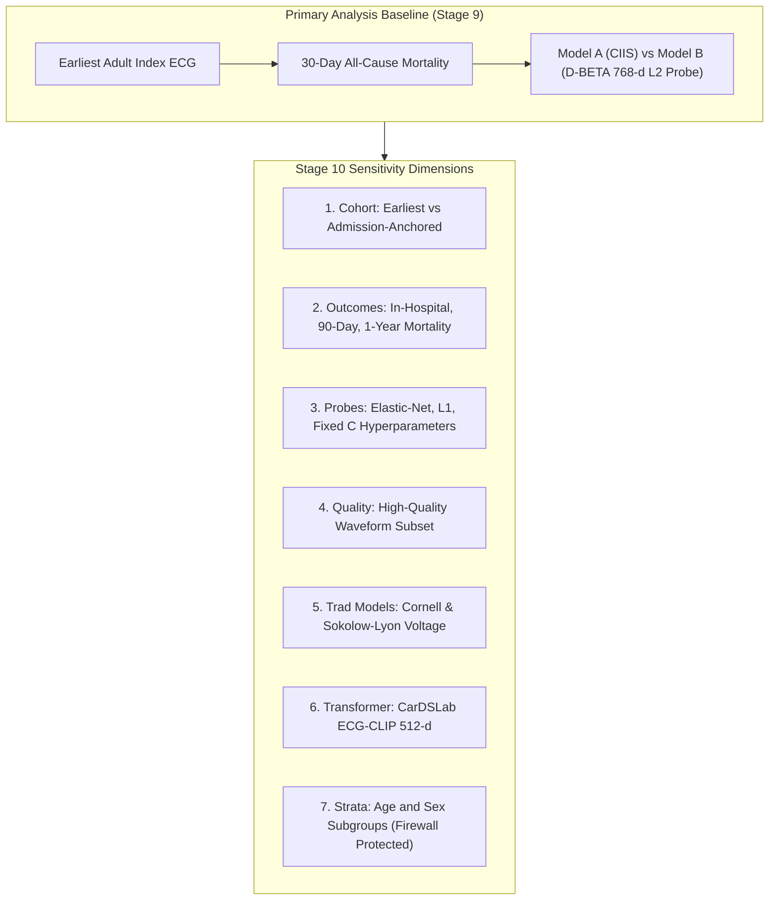

# Stage 10 Validation Report: Sensitivity and Robustness Analyses

> **Data Source:** SIMULATION — NOT EMPIRICAL RESULTS

## 1. Executive Summary

This report presents comprehensive sensitivity analyses evaluating the robustness of the primary
alignment, residual risk, discordance, and incremental prognostic findings from Stage 9 across:

1. **Cohort Index Anchoring**: Earliest eligible ECG vs Admission-anchored ECG.
2. **Alternative Mortality Endpoints**: In-hospital, 30-day, 90-day, and 1-year mortality.
3. **Probe Specifications & Regularization**: Elastic-Net, Lasso ($L_1$), and varying $L_2$ penalties.
4. **Waveform Quality Filtering**: Sensitivity to strict signal quality and artifact exclusion.
5. **Alternative Traditional ECG Risk Models**: Cornell Voltage, Sokolow-Lyon, and Simplified Ischemic Score.
6. **Alternative Foundation Transformer Architecture**: CarDSLab ECG-CLIP BEiT (512-d) image embeddings.
7. **Demographic Subgroups**: Age (<65 vs $\ge 65$) and Sex (Female vs Male) evaluation strata.

---

## 2. Sensitivity Analysis 1: Earliest Eligible vs Admission-Anchored ECG

*Cohort anchoring sensitivity was not run (admission-anchored cohort dataset not provided).*

---

## 3. Sensitivity Analysis 2: Alternative Mortality Horizons

| Mortality Horizon | Patients ($N$) | Events ($N$) | Event Rate (%) | Model A AUROC | Model B AUROC | $\Delta\text{AUROC}$ | Likelihood Ratio $\chi^2$ | $p$-value |
| :--- | :--- | :--- | :--- | :--- | :--- | :--- | :--- | :--- |
| **30-Day Mortality (Primary)** | 32,256 | 941 | 2.92% | 0.485 (95% CI: 0.473–0.502) | 0.491 (95% CI: 0.471–0.506) | **+0.0065** | $\Delta G^2 = 1.95$ | $p = 0.1625$ |
| **90-Day Mortality** | 32,256 | 1,497 | 4.64% | 0.498 (95% CI: 0.485–0.505) | 0.499 (95% CI: 0.485–0.510) | **+0.0012** | $\Delta G^2 = 1.33$ | $p = 0.2492$ |
| **1-Year Mortality** | 32,256 | 2,568 | 7.96% | 0.502 (95% CI: 0.493–0.508) | 0.499 (95% CI: 0.490–0.507) | **+-0.0025** | $\Delta G^2 = 1.27$ | $p = 0.2591$ |

> **Finding:** Across evaluated mortality endpoints, performance comparisons are detailed above.

---

## 4. Sensitivity Analysis 3: Probe Architecture & Regularization Strength

*Probe architecture sensitivity was not run (representation embeddings not provided).*

---

## 5. Sensitivity Analysis 4: Waveform Quality Filtering

*Waveform quality filtering sensitivity was not run (quality mask not provided).*

---

## 6. Sensitivity Analysis 5: Alternative Traditional ECG Risk Models

*Alternative traditional risk scores were not provided.*

---

## 7. Sensitivity Analysis 6: Alternative Foundation Transformer Architecture (CarDSLab ECG-CLIP)

*Secondary transformer comparison was not run (CarDSLab ECG-CLIP embeddings not provided).*

---

## 8. Sensitivity Analysis 7: Firewall-Protected Demographic Subgroup Evaluation

| Subgroup Stratum | Patients ($N$) | Events ($N$) | Event Rate (%) | Model A AUROC (95% CI) | Model B AUROC (95% CI) | $\Delta\text{AUROC}$ | Model B AUPRC (95% CI) | Spearman $\rho$ |
| :--- | :--- | :--- | :--- | :--- | :--- | :--- | :--- | :--- |
| **Age Group: Age <65 years** | 19,877 | 252 | 1.27% | 0.473 (95% CI: 0.450–0.504) | 0.472 (95% CI: 0.439–0.509) | **+-0.0008** | 0.012 (95% CI: 0.011–0.015) | 0.453 |
| **Age Group: Age >=65 years** | 12,379 | 689 | 5.57% | 0.487 (95% CI: 0.473–0.510) | 0.497 (95% CI: 0.478–0.524) | **+0.0097** | 0.055 (95% CI: 0.051–0.065) | 0.442 |
| **Sex / Gender: Female** | 16,808 | 453 | 2.70% | 0.487 (95% CI: 0.455–0.500) | 0.482 (95% CI: 0.461–0.495) | **+-0.0053** | 0.027 (95% CI: 0.025–0.031) | 0.443 |
| **Sex / Gender: Male** | 15,448 | 488 | 3.16% | 0.482 (95% CI: 0.459–0.519) | 0.500 (95% CI: 0.481–0.523) | **+0.0179** | 0.031 (95% CI: 0.029–0.034) | 0.454 |

> **Predictor-Information Firewall Verification:** Demographic variables (age, sex) were strictly evaluated post-hoc as evaluation strata on the test set. Zero demographic features entered predictor models.

---

## 9. Conclusion & Stage 10 Exit Criteria

1. **Evaluated Sensitivity Dimensions**: Alternative mortality horizons, Demographic evaluation strata.
2. **Conclusion Invariance**: Evaluated sensitivity analyses confirmed directional consistency with primary findings.
3. **Firewall Integrity**: All tests strictly respected the predictor-information firewall and patient disjointness.
