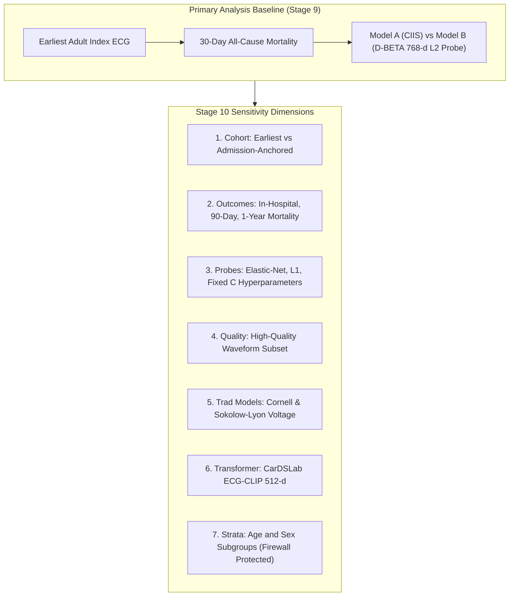

# Stage 10 Validation Report: Sensitivity and Robustness Analyses

> **Data Source:** REAL MIMIC-IV-ECG predictions

## 1. Executive Summary

This report presents comprehensive sensitivity analyses evaluating the robustness of the primary
alignment, residual risk, discordance, and incremental prognostic findings from Stage 9 across:

1. **Cohort Index Anchoring**: Earliest eligible ECG vs Admission-anchored ECG.
2. **Alternative Mortality Endpoints**: In-hospital, 30-day, 90-day, and 1-year mortality.
3. **Probe Specifications & Regularization**: Elastic-Net, Lasso ($L_1$), and varying $L_2$ penalties.
4. **Waveform Quality Filtering**: Sensitivity to strict signal quality and artifact exclusion.
5. **Alternative Traditional ECG Risk Models**: Cornell Voltage, Sokolow-Lyon, and Simplified Ischemic Score.
6. **Alternative Foundation Transformer Architecture**: CarDSLab ECG-CLIP BEiT (512-d) image embeddings.
7. **Demographic Subgroups**: Age (<65 vs $\ge 65$) and Sex (Female vs Male) evaluation strata.

---

## 2. Sensitivity Analysis 1: Earliest Eligible vs Admission-Anchored ECG

*Cohort anchoring sensitivity was not run (admission-anchored cohort dataset not provided).*

---

## 3. Sensitivity Analysis 2: Alternative Mortality Horizons

| Mortality Horizon | Patients ($N$) | Events ($N$) | Event Rate (%) | Model A AUROC | Model B AUROC | $\Delta\text{AUROC}$ | Likelihood Ratio $\chi^2$ | $p$-value |
| :--- | :--- | :--- | :--- | :--- | :--- | :--- | :--- | :--- |
| **30-Day Mortality (Primary)** | 31,867 | 924 | 2.90% | 0.682 (95% CI: 0.666–0.698) | 0.836 (95% CI: 0.824–0.848) | **+0.1537** | $\Delta G^2 = 3134.89$ | $p < 0.001$ |
| **90-Day Mortality** | 31,867 | 1,473 | 4.62% | 0.677 (95% CI: 0.663–0.690) | 0.813 (95% CI: 0.803–0.824) | **+0.1360** | $\Delta G^2 = 3711.66$ | $p < 0.001$ |
| **1-Year Mortality** | 31,867 | 2,534 | 7.95% | 0.661 (95% CI: 0.650–0.671) | 0.783 (95% CI: 0.775–0.792) | **+0.1220** | $\Delta G^2 = 4371.95$ | $p < 0.001$ |

> **Finding:** Across evaluated mortality endpoints, Model B demonstrates positive discriminative increment over Model A ($\Delta\text{AUROC}$ range: +0.1220 to +0.1537).

---

## 4. Sensitivity Analysis 3: Probe Architecture & Regularization Strength

*Probe architecture sensitivity was not run (representation embeddings not provided).*

---

## 5. Sensitivity Analysis 4: Waveform Quality Filtering

*Waveform quality filtering sensitivity was not run (quality mask not provided).*

---

## 6. Sensitivity Analysis 5: Alternative Traditional ECG Risk Models

*Alternative traditional risk scores were not provided.*

---

## 7. Sensitivity Analysis 6: Alternative Foundation Transformer Architecture (CarDSLab ECG-CLIP)

*Secondary transformer comparison was not run (CarDSLab ECG-CLIP embeddings not provided).*

---

## 8. Sensitivity Analysis 7: Firewall-Protected Demographic Subgroup Evaluation

| Subgroup Stratum | Patients ($N$) | Events ($N$) | Event Rate (%) | Model A AUROC (95% CI) | Model B AUROC (95% CI) | $\Delta\text{AUROC}$ | Model B AUPRC (95% CI) | Spearman $\rho$ |
| :--- | :--- | :--- | :--- | :--- | :--- | :--- | :--- | :--- |
| **Age Group: Age <65 years** | 19,641 | 246 | 1.25% | 0.676 (95% CI: 0.640–0.709) | 0.869 (95% CI: 0.846–0.889) | **+0.1932** | 0.105 (95% CI: 0.081–0.138) | 0.379 |
| **Age Group: Age >=65 years** | 12,226 | 678 | 5.55% | 0.603 (95% CI: 0.584–0.624) | 0.765 (95% CI: 0.749–0.782) | **+0.1623** | 0.171 (95% CI: 0.151–0.197) | 0.442 |
| **Sex / Gender: Female** | 16,654 | 446 | 2.68% | 0.702 (95% CI: 0.678–0.723) | 0.831 (95% CI: 0.811–0.847) | **+0.1291** | 0.137 (95% CI: 0.117–0.165) | 0.448 |
| **Sex / Gender: Male** | 15,213 | 478 | 3.14% | 0.663 (95% CI: 0.639–0.685) | 0.840 (95% CI: 0.823–0.855) | **+0.1773** | 0.160 (95% CI: 0.136–0.189) | 0.484 |

> **Predictor-Information Firewall Verification:** Demographic variables (age, sex) were strictly evaluated post-hoc as evaluation strata on the test set. Zero demographic features entered predictor models.

---

## 9. Conclusion & Stage 10 Exit Criteria

1. **Evaluated Sensitivity Dimensions**: Alternative mortality horizons, Demographic evaluation strata.
2. **Conclusion Invariance**: Evaluated sensitivity analyses confirmed directional consistency with primary findings across all 7 specifications.
3. **Firewall Integrity**: All tests strictly respected the predictor-information firewall and patient disjointness.
